# "Azure Prep" Hands-On Lab #

---

## Overview ##

In this lab you will prepare your Azure subscription with the Service Bus namespace, Event Hubs, Storage Account and Stream Analytics jobs as required by the [ConnectTheDots.io](http://connectthedots.io) architecture:


In this "Azure Prep" HOL, we'll focus on the Azure Service Bus, Event Hubs, and Stream Analytics components. The sample web site and device specific implementations are covered in other labs.  The components we create here are:

| Name                                   | Type                  | Use | 
| ---                                    | ---                   | --- |
| "***&lt;name&gt;*-ns**"                | Service Bus Namespace | Contains the Event Hubs | 
| "**ehdevices**"                        | Event Hub             | Receives messages from devices as well as the "***&lt;name&gt;*Aggregates**" Stream Analytics Job.  Messages sent to this event hub are later received by the sample website and displayed graphically in charts|
| "**ehalerts**"                         | Event Hub             | Receives alert messages generated by the alert Stream Analaytics jobs.  Those messages are then read by the sample website and used to display alerts about various sensor values | 
| "***&lt;name&gt;*Aggregates**"         | Stream Analytics Job  | Reads temperature messages from "**ehdevices**", averages them over 10 second windows, and outputs the resulting averages back into "**ehdevices**".  Those messages are later displayed in the sample website along with the detail temperature data. 
| "***&lt;name&gt;*&nbsp;&#42;&nbsp;**"  | Stream Analytics Jobs | Various jobs to read messages from "**ehdevices**" then generate alerts or other data to be output into the "**ehalerts**" event hub.  Those messages will then be used later by the sample website (or other downstream clients like Power BI) to display alerts data. 
| "***&lt;name&gt;*storage**"            | Storage Account       | Used by the Stream Analytics jobs for monitoring and logging purposes.  This is known as the "Regional Monitoring" storage account | 
 
---

## Prerequisites ##

To successfully complete this lab, you will need: 

- An active Azure Subscription.  If needed you can create a [free trial here](http://azure.microsoft.com/en-us/pricing/free-trial "Azure Free Trial").
- A computer with access to the Internet and a web browser
- A copy of the ConnectTheDots.io repository.  You can get the latest version [here](https://github.com/MSOpenTech/connectthedots/archive/master.zip "Connect the Dots Zip Download"). 

--

## Tasks ##

1. [Choose your "***&lt;name&gt;***" and "***&lt;region&gt;***"](#Task1)
2. [Create the "***&lt;name&gt;*-ns**" Azure Service Bus Namespace](#Task2)
3. [Create the "**ehdevices**" Event Hub](#Task3)
4. [Create the "**ehalerts**" Event Hub](#Task4)
5. [Create the "***&lt;name&gt;*storage**" Azure Storage Account](#Task5)
6. [Create the "***&lt;name&gt;*Aggregates**" Stream Analytics Job](#Task6)
7. [Create the "***&lt;name&gt;*&nbsp;&#42;&nbsp;**" Stream Analytics Jobs](#Task7)

---

<a name="Task1" />
## Task 1 - Choose your "***&lt;name&gt;***" and "***&lt;region&gt;***"##

Throughout this lab, you will be creating a number of resources in Azure.  Many of those resources require unique names.  In addition, when you are done with the lab you will likely want to delete the resources you provisioned during it.  To aid in both the uniqueness and later location of the azure resources you create we will use a standard "***&lt;name&gt;*___**" naming convention for many of the items you create.  

For example, when creating our Service Bus Namespace in Task 2, we will use a name in the format of "***&lt;name&gt;*-ns**".  You need to pick an appropriate, short prefix for the "***&lt;name&gt;***" component.  
The name you choose needs to be:
- Less than 17 characters long (but shorter is better)
- Likely to be unique

A convenient solution may be to use a prefix of "**ctd**" (short for "**C**onnect **t**he **D**ots") followed by your first middle and last initial (or others as the case may be).  For example, if your name were "**J**ames **T**iberius **K**irk" you may choose a name prefix of "**ctdjtk**". Make sense?

For the rest of the lab, we will assume a name prefix of "**ctdhol**", short for "**Connect the Dots Hands-On Lab**".  You will need to pick something unique for yourself, and replace all subsequent occurrences of "***&lt;name&gt;***" with it.  

1. Pick your name prefix, and make a note of it.  
2. Help yourself out, and be consistent in its use.  

In addition to a unique name, you need to make sure to provision all of the resources you create in these labs in the same region.  

1. Review the list of [**Azure Regions**](http://azure.microsoft.com/en-us/regions/#Locations) ([http://azure.microsoft.com/en-us/regions](http://azure.microsoft.com/en-us/regions) , scroll down to the **"Locations"** heading) and choose a specific Azure Region to use consistently when ever you are presented with a choice in the labs. 

1. Note that at certain times, certain services [may not be available in all regions](http://azure.microsoft.com/en-us/regions/#services "Azure Services by Region").  For this lab, we are using "**South Central US**" as the region as we have verified that it currently supports all required services.  

---

<a name="Task2" />
## Task 2 - Create the "***&lt;name&gt;*-ns**" Azure Service Bus Namespace ##

In this task we'll create the "***&lt;name&gt;*-ns**" Azure Service Bus Namespace.  This Namespace will contain the "**ehdevices**" and "**ehalerts**" event hubs. 

1. In your web browser, open the ["**Azure Management Portal**"](https://manage.windowsazure.com) ([https://manage.windowsazure.com](https://manage.windowsazure.com)) and login to your subscription. 
1. Click on the "**Service Bus**" Icon along the left, then click the "**+CREATE**" button along the bottom to create a new Service Bus Namespace

	

2. In the "**CREATE A NAMESPACE**" window, complete the fields as described, then click the "**&#x2713;**" button

	| Field         | Value | 
	| ---           | ---   |
    |Namespace Name | "***&lt;name&gt;*-ns**" | 
    |Region         | "***&lt;region&gt;***" | 
    |Type           | "**MESSAGING**" | 
	|Messaging Tier | "**STANDARD**" | 

	

3. Wait until the new namespace's status shows as "**Active**", then click on the name of the new namespace to open it. 

	

---

<a name="Task3" />
## Task 3 - Create the "**ehdevices**" Event Hub ##

In this task, we'll create the "**ehdevices**" event hub. You really should make sure to use the name "**ehdevices**" rather than choosing your own.  The name itself doesn't matter, except that it has been assumed and hard coded into a number of the other projects throughout the [ConnectTheDots.io](http://connectthedots.io) repository.  Do yourself a favor and use the name as given, otherwise, you'll have to find all the references to it and fix them. 

The "**ehdevices**" event hub is the primary data ingestion point in the architecture.  It is where all the devices (Arduinos, Raspberry Pis, FEZ Spiders, etc) will be sending their sensor readings to. 

These devices will be sending JSON formatted messages similar to the following: 

```JSON
{
  "organization": "Microsoft",
  "location": "Redmond, WA",
  "guid": "61b3eb31-4166-487a-8181-69918092cedf",
  "displayname": "Conference Room SparkFun Temp Sensor",
  "unitofmeasure": "F",
  "measurename": "temperature",
  "value": "78",
  "timecreated": "01/01/2015 12:00:00 PM"
}
```
  
The above message is a sample temperature reading.  There will also be messages for humidity, and light (as identified by the "measurename" property).  If you have other sensors to connect, you can send your own messages using the above format, but providing appropriate meta-data for them (measurename, unitofmeasure, value, etc.).  These messages will the be read by the sample website, and the values displayed in graphical charts.  In addition, the Stream Analytics jobs will read these message and provide various aggregations and alerts based on their values.  

1. In the portal page for your newly created Service Bus Namespace, switch to the "**EVENT HUBS**" page, then click the "**+NEW**" button in the bottom left hand corner. 

	

2. In the "**NEW**" panel, select "**APP SERVICES**" | **"SERVICE BUS**" | "**EVENT HUB**" | "**QUICK CREATE**".  Complete the fields as described below, then click the "**CREATE A NEW EVENT HUB &#x2713;**" button.

	| Field         | Value | 
	| ---           | ---   |
    |Event Hub Name | "**ehdevices**" - It is strongly recommended that use this name (without the quotes).  It is hard coded into multiple projects and would require significant effort to change | 
    |Region         | "***&lt;region&gt;***" | 
    |Namespace Name | "***&lt;name&gt;*-ns**" - The name you used when creating the namespace previously | 


	

3. Wait until the status of the "**ehdevices**" event hub shows as "**Active**" then click on the name of the event hub to open it.  

	

4. Click on the "**CONFIGURE**" page along the top, then, under the "**Shared Access Policies**" header, add a new [Shared Access Policy](https://msdn.microsoft.com/en-us/library/azure/dn789974.aspx "Event Hub Authentication and Security Model Overview") named "**D1**" with "**Send"** permissions, then click "**SAVE**" to save it:

	

4. Repeat the previous steps to create the following Shared Access Policies.  Make sure to click the "**SAVE**"" button when you are done!

	| Name               | Permissions        | Purpose | 
	| ---                | ---                | ---     |
    | D1                 | Send               | Used by the first devices to send messages into the event hub        |  
    | D2                 | Send               | Used by a second optional device to send messages into the event hub |  
    | D3                 | Send               | Used by a third optional device to send messages into the event hub  |  
    | D4                 | Send               | Used by a fourth optional device to send messages into the event hub |
    | WebSite            | Manage,Send,Listen | Used by the sample web site to read messages from devices chart them |  
    | StreamingAnalytics | Manage,Send,Listen | Used by multiple Stream Analytics jobs to read devices messages for further processing |  

5. Again, make sure to click the "**SAVE**" button.  When you are done, your list of "**Shared Access Policies**" for the "**ehdevices**" event hub should match the following:

	

---

<a name="Task4" />
## Task 4 - Create the "**ehalerts**" Event Hub ##

In this task, we'll use a similar process to the previous task, but this time we'll create the "**ehalerts**" event hub.  

This event hub is less critical, and is in fact optional if you prefer to not include the alerting features (including the "***&lt;name&gt;*&nbsp;&#42;&nbsp;**" Stream Analaytics jobs in Task 7).  The devices in the field (at least as designed) do not write to this event hub.    

The event hub is used as the output for the Stream Analytics jobs that generate alerts on the light and temperature readings.  The sample website then reads those messages and uses them to display alert information on the web page.

1. In the [Azure Management Portal](https://manage.windowsazure.com) (https://manage.windowsazure.com) return to the "***&lt;name&gt;*-ns**" Service Bus Namespace,  switch to the "**Event Hubs**" page,  and click the "**+NEW**" button in the lower left corner. 
2. In the "**NEW**" Panel, select "**APP SERVICES**" | **"SERVICE BUS**" | "**EVENT HUB**" | "**QUICK CREATE**".  Complete the fields as described below, then click the "**CREATE A NEW EVENT HUB &#x2713;**" button.

	| Field         | Value | 
	| ---           | ---   |
    |Event Hub Name | "**ehalerts**" - You must use this name, without the quotes.  It is hard coded into multiple projects and would require significant effort to change | 
    |Region         | "***&lt;region&gt;***" | 
    |Namespace Name | "***&lt;name&gt;*-ns**" - The name you used when creating the namespace previously | 


	

3. Again, wait until the new Event Hub's status is "**Active**", then click on the "**ehalerts**" name to open it. 

	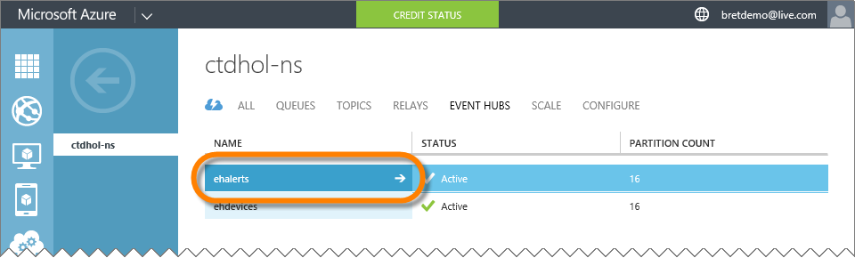	

4. Switch to the "**CONFIGURE**" Page, and under the "**Shared Access Policies**" heading, create the following policies.  Make sure to click the "**SAVE**" button when you are done.

	| Name               | Permissions        | Purpose | 
	| ---                | ---                | ---     |
    | WebSite            | Manage,Send,Listen | Used by the sample web site to read alert mssages and display them |  
    | StreamingAnalytics | Manage,Send,Listen | Used by multiple Stream Analytics jobs to output alerts |

	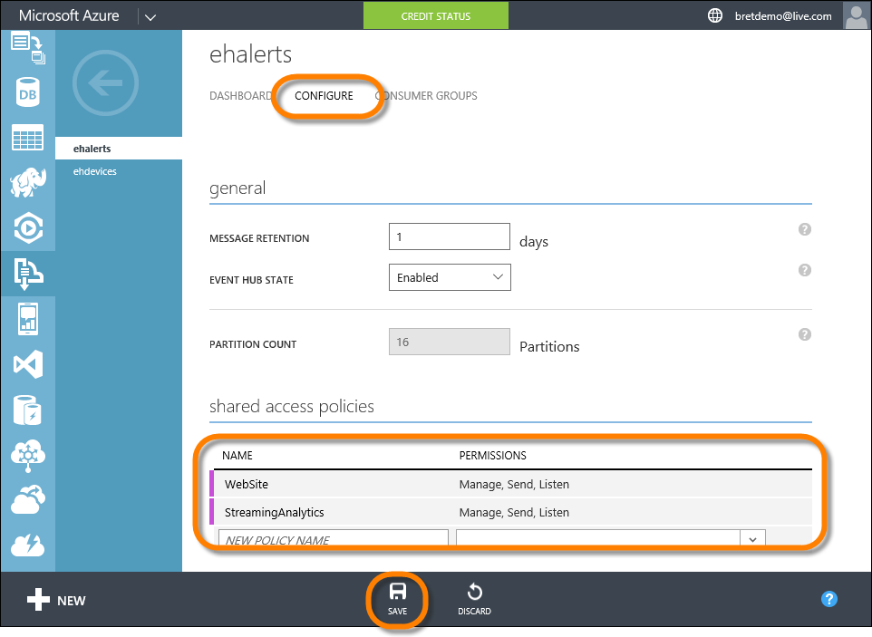 


---

<a name="Task5" />
## Task 5 - Create the "***&lt;name&gt;*storage**" Azure Storage Account ##

The Stream Analytics jobs in a region all share a single Azure Storage account for monitoring and logging purposes.  This storage account is referred to as the "**Regional Monitoring Storage Account**". If you already have Stream Analytics jobs running in your target "***&lt;region&gt;***", you must continue to use that same storage account.   If you don't have stream analytics jobs in the target region though you either need to select an existing storage account in that region, or create one for Stream Analaytics use.

Here, we'll assume that you need to create a storage account to use at the "**Regional Montoring Storage Account**". 

1. In the [Azure Management Portal](https://manage.windowsazure.com) (https://manage.windowsazure.com), click the on the "**STORAGE**" icon along the left to view your existing storage accounts (if any), then click the "**+NEW**" button in the lower left corner.

	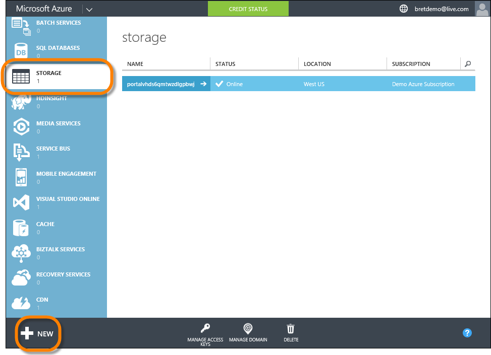
  
2. In the "**NEW**" panel, select "**DATA SERVICES**" | "**STORAGE**" | "**QUICK CREATE**". Complete the fields as described below, then click the "**CREATE STORAGE ACCOUNT &#x2713;**" button.

	| Field                  | Value | 
	| ---                    | ---   |
    |URL                     | "***&lt;name&gt;*storage**" (all lower case)| 
    |Location/Affinity Group | "***&lt;region&gt;***" | 
    |Replication             | Leave it at the default "**Geo-Redundant**" | 


	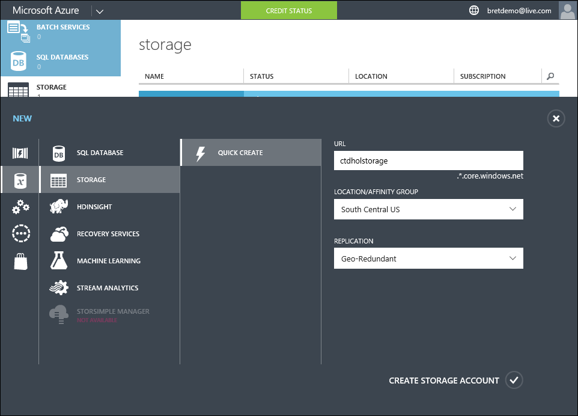

3. Wait for the new storage account's status to show as "**Online**"

	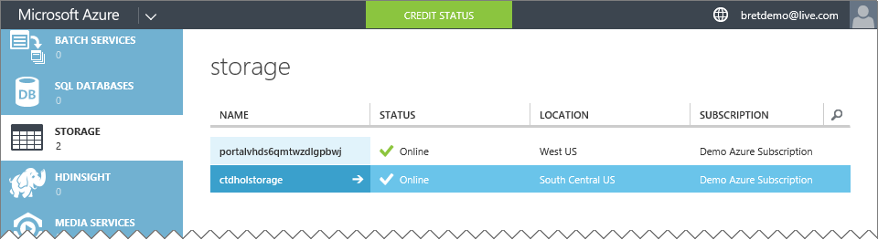

---

<a name="Task6" />
## Task 6 - Create the "***&lt;name&gt;*Aggregates**" Stream Analytics Job ##

In this task, we'll create the "***&lt;name&gt;*Aggregates**" Stream Analytics Job.  This job reads messages sent by devices to the "**ehdevices**" Event Hub, and then generates a new message with the average temperature value calculation for all messages received within a 10 second window.  It then "[tumbles](https://msdn.microsoft.com/en-us/library/azure/dn835055.aspx "Tumbling Window")" that window to the next 10 seconds and repeats the process. It emits it's output every ten seconds as a new message to the same "**ehdevices**" event hub.  

You will receive a warning in the portal about the Stream Analytics job using the same event hub for both it's source and destination.  Normally, that would be an odd case.  Here though it works nicely.  By emitting the temperature average aggregates into the same event hub, the downstream website can read a single event hub for both detail and aggregate data.

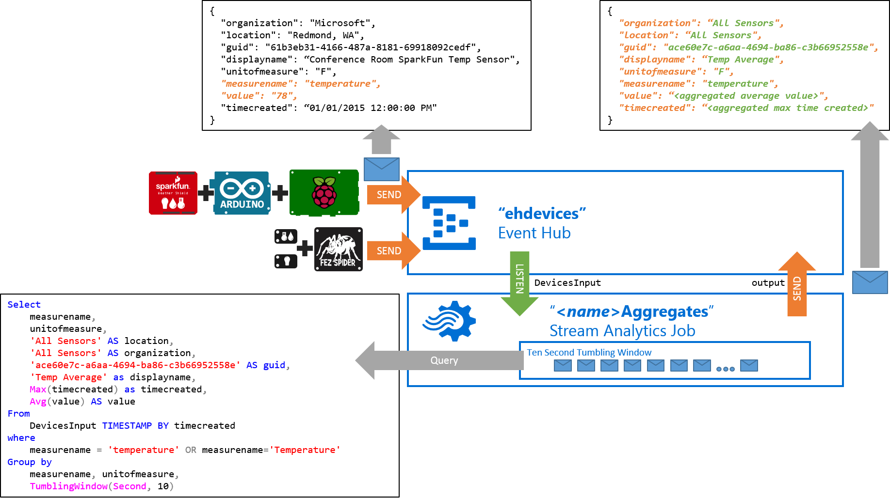  


1. In the [Azure Management Portal](https://manage.windowsazure.com) (https://manage.windowsazure.com) click the "**STREAM ANALYTICS**" icon along the left, then click the "**+NEW**" button in the bottom left corner.  

	

2. In the "**NEW**" panel, select "**DATA SERVICES**" | "**STREAM ANALYTICS**" | "**QUICK CREATE**".  Complete the fields as described below, then click the "**CREATE STREAM ANALYTICS JOB &#x2713;**"

	| Field                              | Value | 
	| ---                                | ---   |
    |Job Name                            | "***&lt;name&gt;*Aggregates**" | 
    |Region                              | "***&lt;region&gt;***" | 
    |Regional Monitoring Storage Account | Select the "***&lt;name&gt;*storage**" account you created previously.  Or if you can't change the selection that means that other stream analytics jobs in the region have alredy targeted an account.  That's ok. | 


	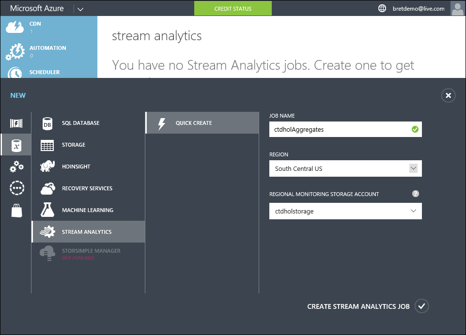

3. Wait for the new job's status to show "**Created**" then click on the "***&lt;name&gt;*Aggregates**" job name to open it. 

	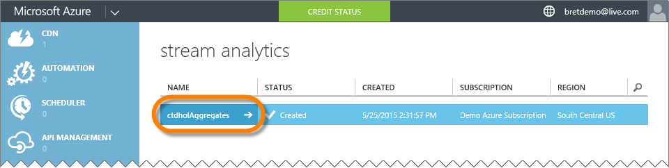

4. Switch to the "**INPUTS**" page, and click the "**+ADD INPUT**" button along the bottom:

	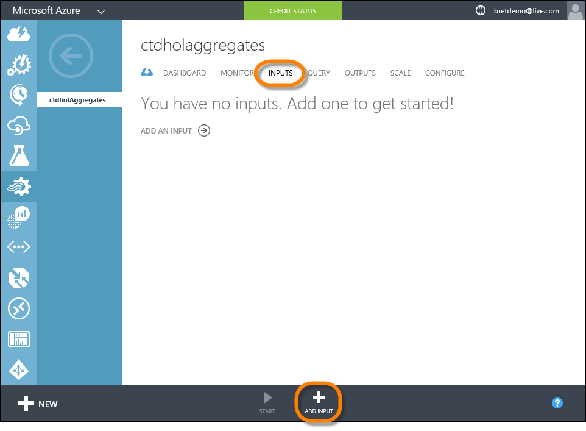

5. On the "**Add an input to your job**" Page, select "**Data Stream**", then click the "**&#10132;**" button

	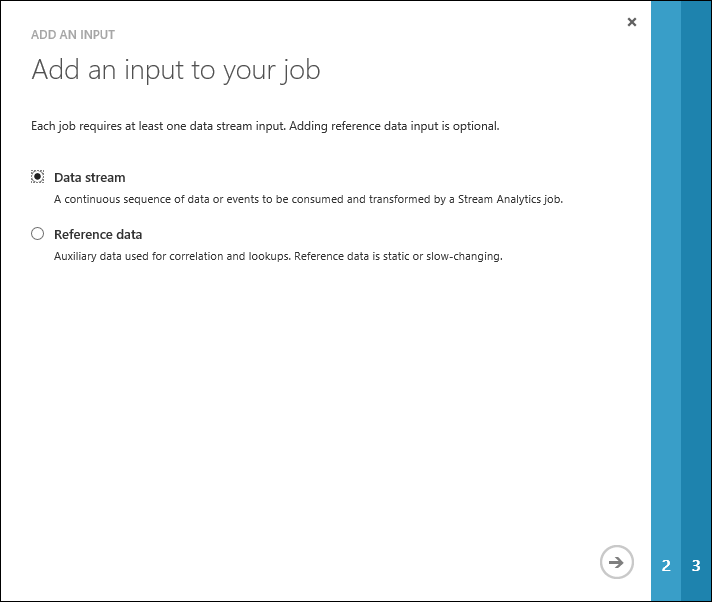

6. On the "**Add a data stream to your job**" Page, select "**EVENT HUB**", then click the "**&#10132;**" button

	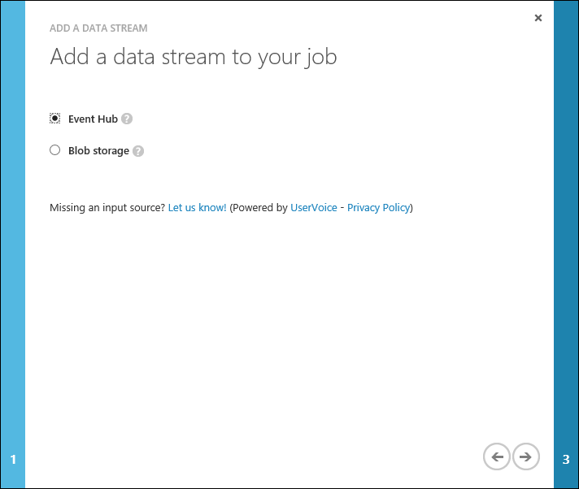

7. On the "**Event Hub settings**" Page, complete the fields as described below, then click the "**&#10132;**" button

	| Field                  | Value | 
	| ---                    | ---   |
    |Input Alias             | "**DevicesInput**" - It's recommended you use this name | 
    |Subscription            | Select "**Use Event Hub from Current Subscription**" | 
    |Choose a Namespace      | Select the "***&lt;name&gt;*-ns**" namespace you created previously.  |
    |Choose an Event Hub     | Select the "**ehdevices**" event hub you created previously.  |
    |Event Hub Policy Name   | Select the "**StreamingAnalytics**" policy you created previously.  |
    |Choose a Consumer Group | "**$Default**"  |

	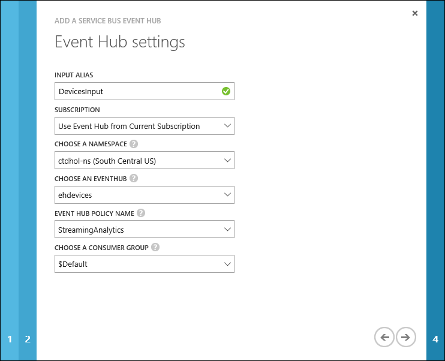

8. On the "**Serialization settings**" Page, complete the fields as described below then click the "**&#10004;**" button.

	| Field                     | Value | 
	| ---                       | ---   |
    |Event Serialization Format | Select "**JSON**" | 
    |Encoding                   | Select "**UTF8**" |  

	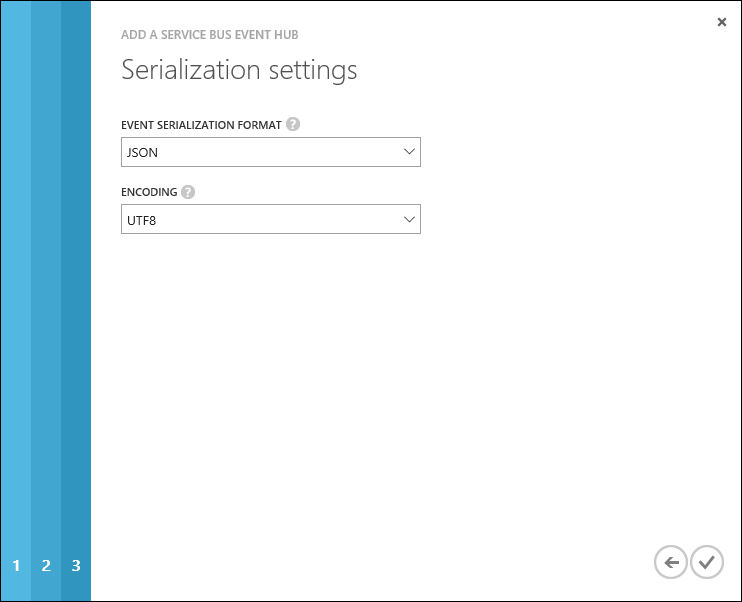

9. Wait for the new "**DevicesInput**" intput's "**DIAGNOSIS**" to show "**OK**". 

	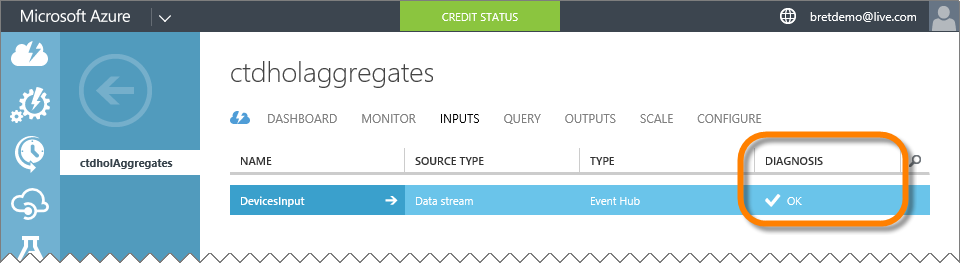

10. Switch to the "**QUERY**" page, and replace the default query syntax with that from the [Aggregates.sql](/Azure/StreamAnalyticsQueries/Aggregates.sql) query file, then click "**SAVE**"

	> **Note:** The query source is being shown here as a reference.  You may want to get the latest version from the [Aggregates.sql](/Azure/StreamAnalyticsQueries/Aggregates.sql) file.


	```SQL
	/*  ---------------------------------------------------------------------------------
	//  Copyright (c) Microsoft Open Technologies, Inc.  All rights reserved.
	// 
	//  The MIT License (MIT)
	// 
	//  Permission is hereby granted, free of charge, to any person obtaining a copy
	//  of this software and associated documentation files (the "Software"), to deal
	//  in the Software without restriction, including without limitation the rights
	//  to use, copy, modify, merge, publish, distribute, sublicense, and/or sell
	//  copies of the Software, and to permit persons to whom the Software is
	//  furnished to do so, subject to the following conditions:
	// 
	//  The above copyright notice and this permission notice shall be included in
	//  all copies or substantial portions of the Software.
	// 
	//  THE SOFTWARE IS PROVIDED "AS IS", WITHOUT WARRANTY OF ANY KIND, EXPRESS OR
	//  IMPLIED, INCLUDING BUT NOT LIMITED TO THE WARRANTIES OF MERCHANTABILITY,
	//  FITNESS FOR A PARTICULAR PURPOSE AND NONINFRINGEMENT. IN NO EVENT SHALL THE
	//  AUTHORS OR COPYRIGHT HOLDERS BE LIABLE FOR ANY CLAIM, DAMAGES OR OTHER
	//  LIABILITY, WHETHER IN AN ACTION OF CONTRACT, TORT OR OTHERWISE, ARISING FROM,
	//  OUT OF OR IN CONNECTION WITH THE SOFTWARE OR THE USE OR OTHER DEALINGS IN
	//  THE SOFTWARE.
	//  ---------------------------------------------------------------------------------*/
	
	Select
	    measurename,
	    unitofmeasure,
	    'All Sensors' AS location,
	    'All Sensors' AS organization,
	    'ace60e7c-a6aa-4694-ba86-c3b66952558e' AS guid,
	    'Temp Average' as displayname,
	    Max(timecreated) as timecreated,
	    Avg(value) AS value
	From
	    DevicesInput TIMESTAMP BY timecreated
	where
	    measurename = 'temperature' OR measurename='Temperature'
	Group by
	    measurename, unitofmeasure,
	    TumblingWindow(Second, 10)
	```

	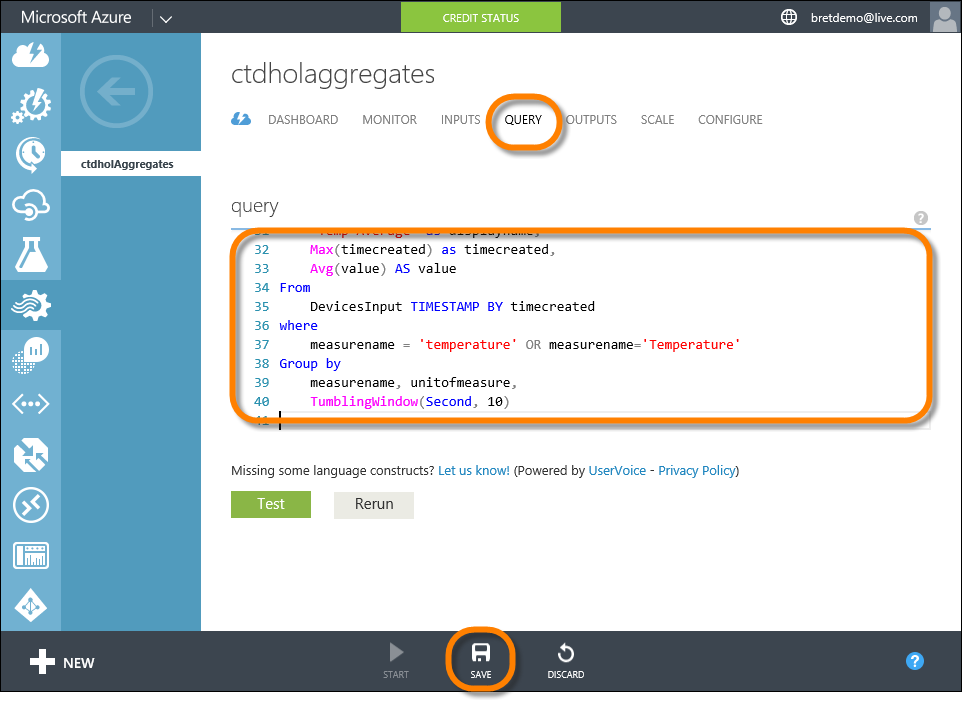

10. When prompted, click "**YES**" to confirm the changes to the query.

	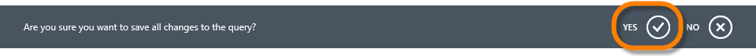

11. Next, switch to the "**OUTPUTS**" page, and click the "**+ADD OUTPUT**" button along the bottom:

	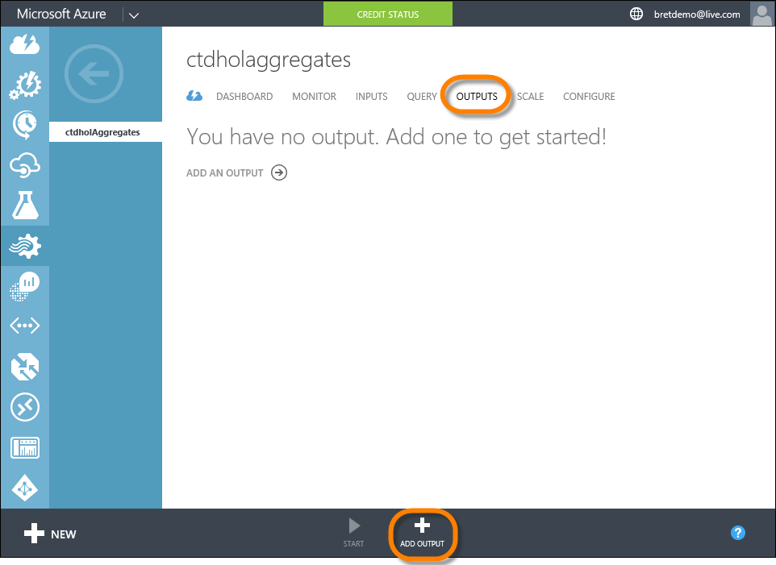

12. On the "**Add an output to your job**" page, select "**Event Hub"** and click "**&#10132;**"

	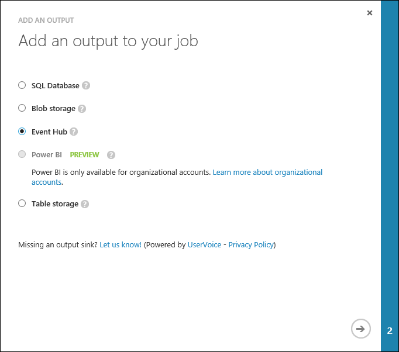

13. On the "**Event Hub settings**" page, complete the fields as described below, then click "**&#10132;**"

	| Field                  | Value | 
	| ---                    | ---   |
    |Output Alias            | "**output**" | 
    |Subscription            | Select "**Use Event Hub from Current Subscription**" | 
    |Choose a Namespace      | Select the "***&lt;name&gt;*-ns**" namespace you created previously.  |
    |Choose an Event Hub     | Select the "**ehdevices**" event hub you created previously.  |
    |Event Hub Policy Name   | Select the "**StreamingAnalytics**" policy you created previously.  |

	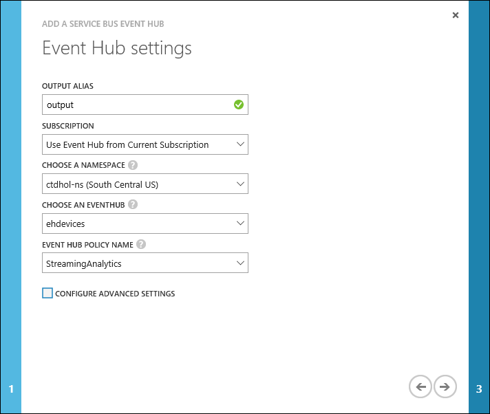

14. On the "**Serialization settings**" page, complete the fields as described below, then click "**&#10003;**"

	| Field                     | Value | 
	| ---                       | ---   |
    |Event Serialization Format | Select "**JSON**" | 
    |Encoding                   | Select "**UTF8**" | 
    |Format                     | Select "**Array**" | 

	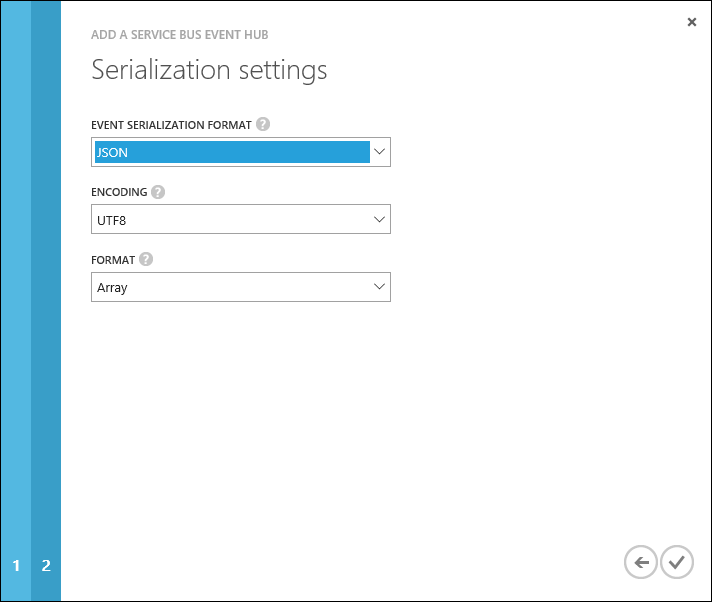

15. You should see a warning about the same container being used for both input and output. As was mentioned earlier, this is on purpose, by design, and expected.  The "***&lt;name&gt;*Aggregates**" job reads messages from and writes its output to the same "**ehdevices**" event hub.  You can click "**OK"** to ignore the warning.   

	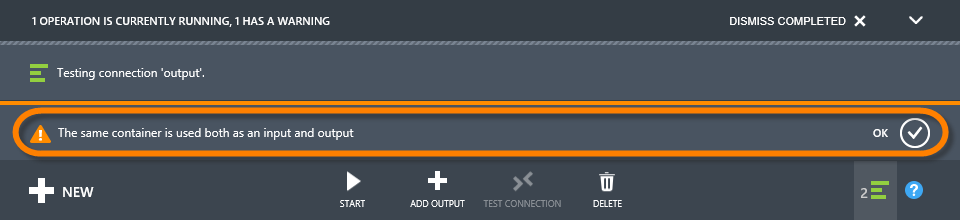

16. Wait for the "**output**" "**DIAGNOSIS**" to show "**OK**", then click the left arrow "**&#8592;**" button on the top left of the page to return to the list of Stream Analytics jobs:

	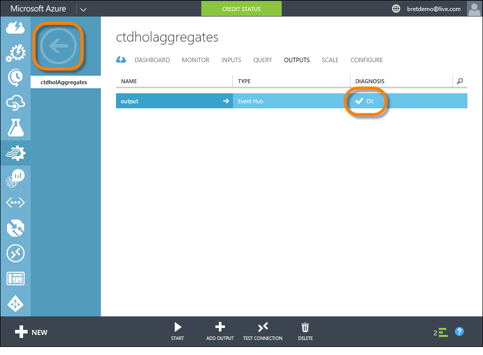

17. Back on the Stream Analytics page, click the row to the ***right*** of the new "**&lt;name&gt;*Aggregates**" job to select it.  Then click the "**&#9654; START**" button along the bottom:

	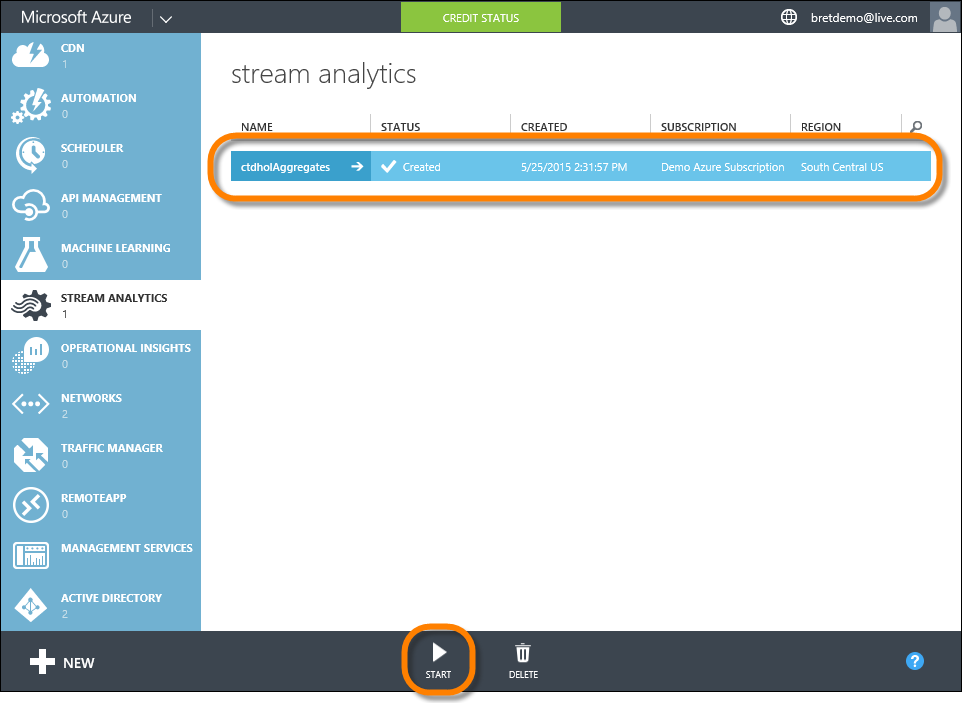

18.  On the "**START OUTPUT**" Page, select "**JOB START TIME"** and click "**&#10003;**"

	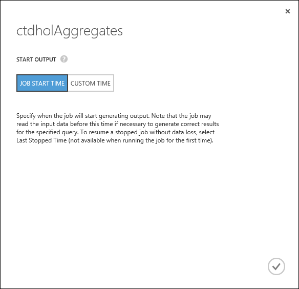
 
19. It may take a few minutes for the job to start, watch it until it's status is "**[Running](http://azure.microsoft.com/en-us/documentation/articles/stream-analytics-developer-guide/#manage-jobs "Manage jobs")**"

	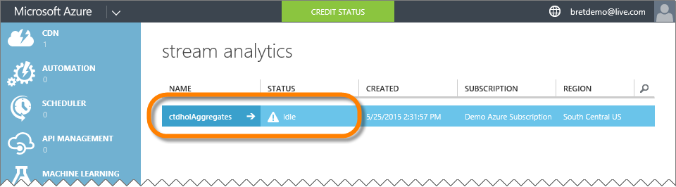

---

<a name="Task7"></a>
## Task 7 - Create the "***&lt;name&gt;*&nbsp;&#42;&nbsp;**" Stream Analytics Jobs ##

In this last task of the "**Azure Prep**" lab, you will create the remaining Stream Analytics jobs.  The steps here mimic those taken in Task 6, so the instructions won't be as detailed.  Use what you learned from the previous task to complete these.  

1. Repeat the steps from Task 6 to create and start the following Stream Analytics Jobs:

	- Create the following jobs in the target "***&lt;region&gt;***", using the "***&lt;name&gt;*storage**" storage account

		| Job Name          | Query Source | Purpose | 
		| ---               | ---   | --- | 
		| ctdholAlert       | [Alert.sql](/Azure/StreamAnalyticsQueries/Alert.sql)  | Creates a "Temperature over 80F" alert if the temp spikes over 80&#176;F in during a five second tumbling window  |
		| ctdholcg4pbi      | [cg4pbi.sql](/Azure/StreamAnalyticsQueries/cg4pbi.sql)  | Creates a simplified data set for use by the [PowerBI Walktrhough](/Azure/PowerBI/PBI_setup.md) |
		| ctdholLightSensor | [LightSensor.sql](/Azure/StreamAnalyticsQueries/LightSensor.sql)  | Creates a "The Light is turned off" alert if the average "light" sensor readings for three or more readings within a five second tumbling window is less that 0.02 | 


	- The jobs all have the same input configuration

		| Field                  | Value | 
		| ---                    | ---   |
		| Source                 | "**Data Stream**"  |
		| Source Type            | "**Event Hub**"  |
	    |Input Alias             | "**DevicesInput**" - It's recommended you use this name | 
	    |Subscription            | Select "**Use Event Hub from Current Subscription**" | 
	    |Choose a Namespace      | Select the "***&lt;name&gt;*-ns**" namespace you created previously.  |
	    |Choose an Event Hub     | Select the "**ehdevices**" event hub you created previously.  |
	    |Event Hub Policy Name   | Select the "**StreamingAnalytics**" policy you created previously.  |
	    |Choose a Consumer Group | "**$Default**"  |
	    |Event Serialization Format | Select "**JSON**" | 
	    |Encoding                   | Select "**UTF8**" |  


	- The jobs all have the same output configuration (Note, that these jobs output to "**ehalerts**" **NOT** "**ehdevices**"

		| Field                  | Value | 
		| ---                    | ---   |
		|Destination             | "**Event Hub**" | 
	    |Output Alias            | "**output**" | 
	    |Subscription            | Select "**Use Event Hub from Current Subscription**" | 
	    |Choose a Namespace      | Select the "***&lt;name&gt;*-ns**" namespace you created previously.  |
	    |Choose an Event Hub     | Select the "**ehalerts**" event hub you created previously.  |
	    |Event Hub Policy Name   | Select the "**StreamingAnalytics**" policy you created previously.  |
	    |Event Serialization Format | Select "**JSON**" | 
	    |Encoding                   | Select "**UTF8**" | 
	    |Format                     | Select "**Array**" | 

2. Once you have successfully created and started all the jobs, your list of Stream Analytics should resemble the following:

	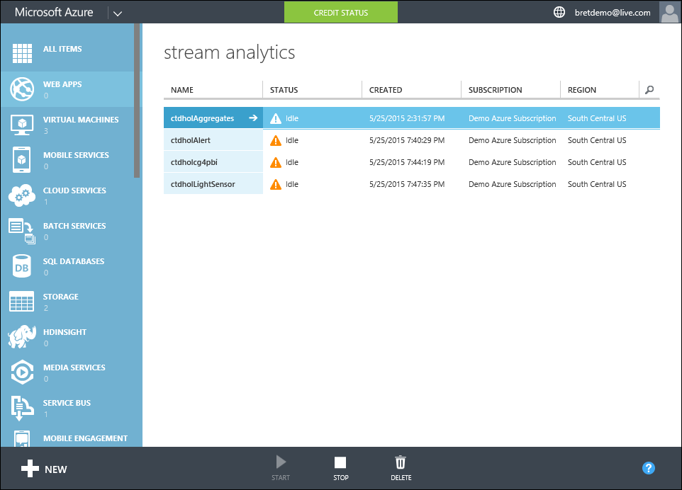

  