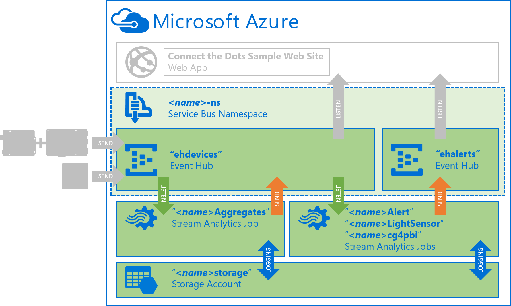
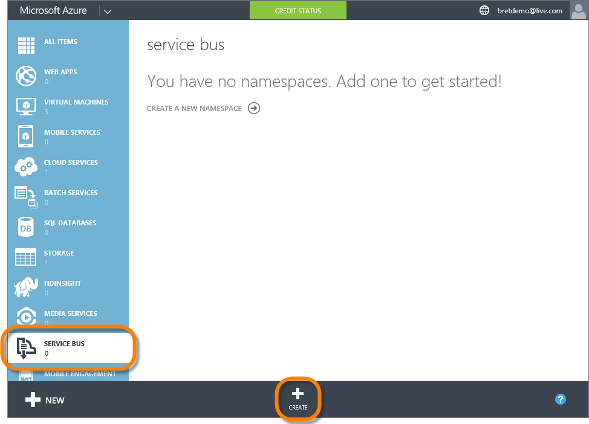
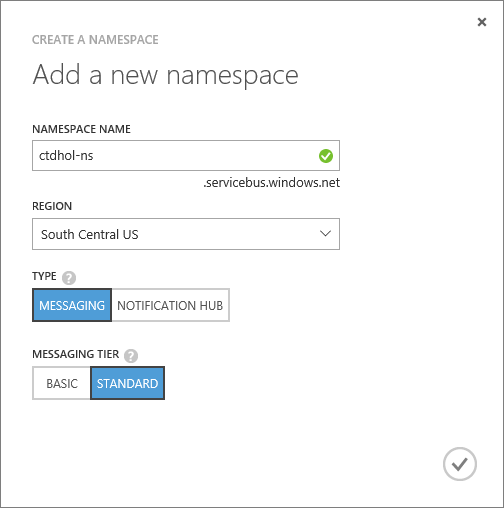
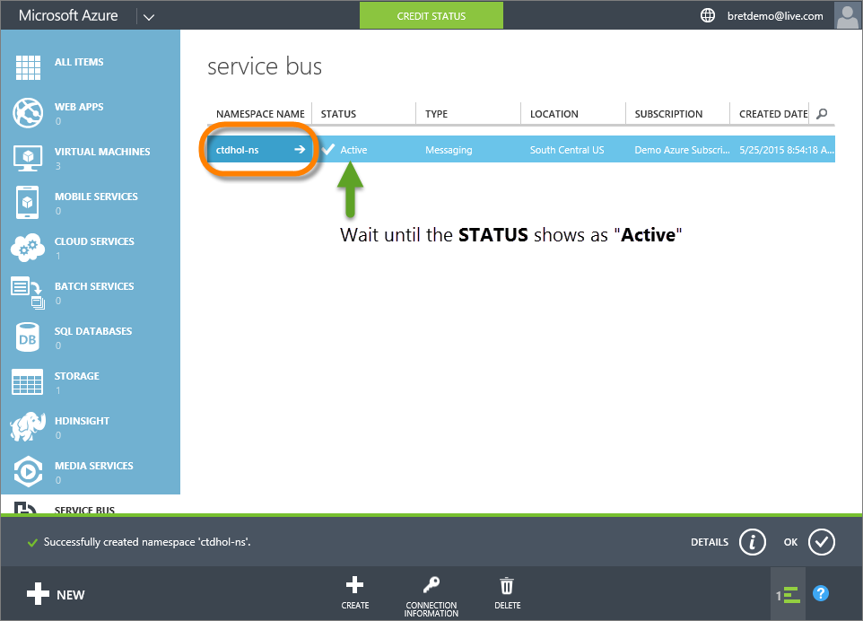
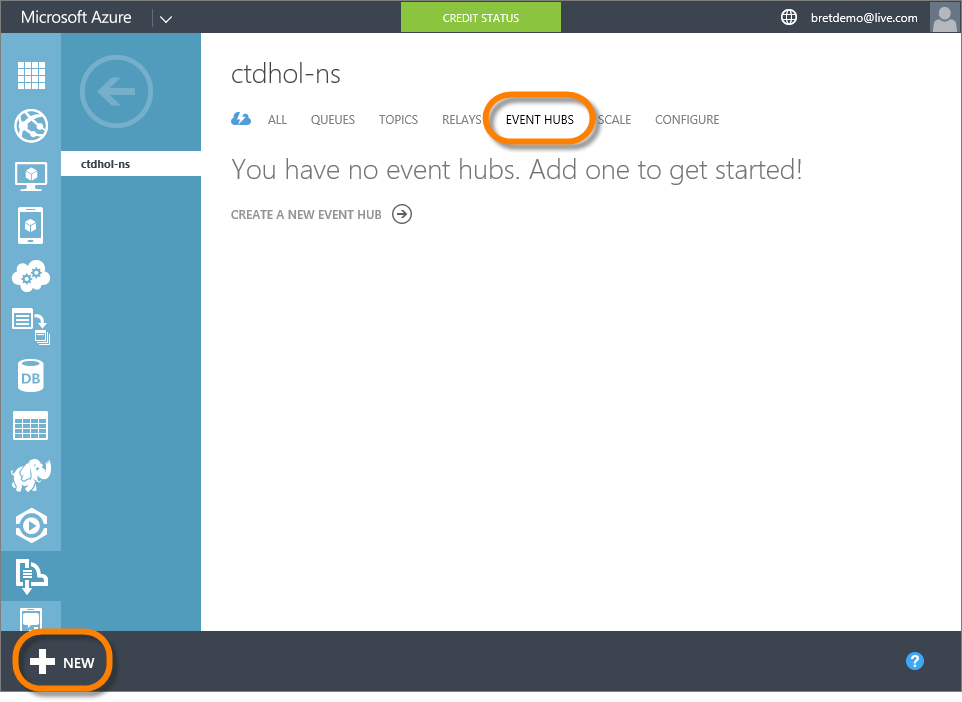
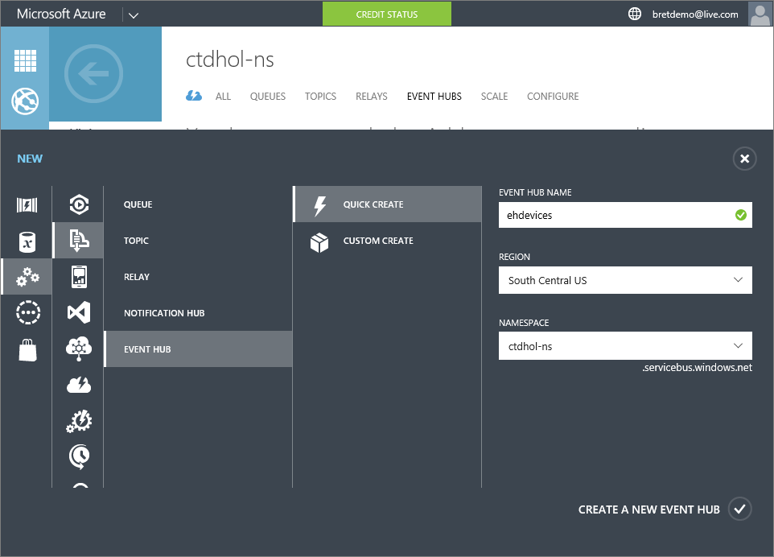
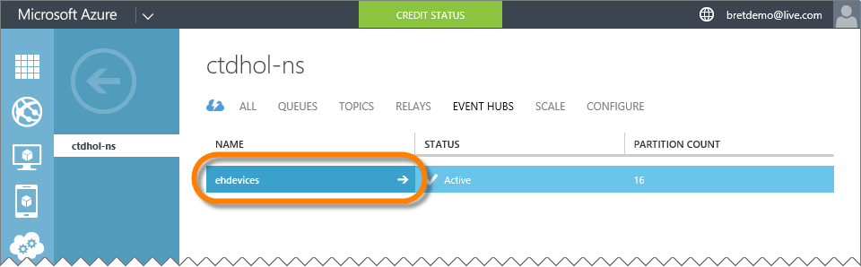
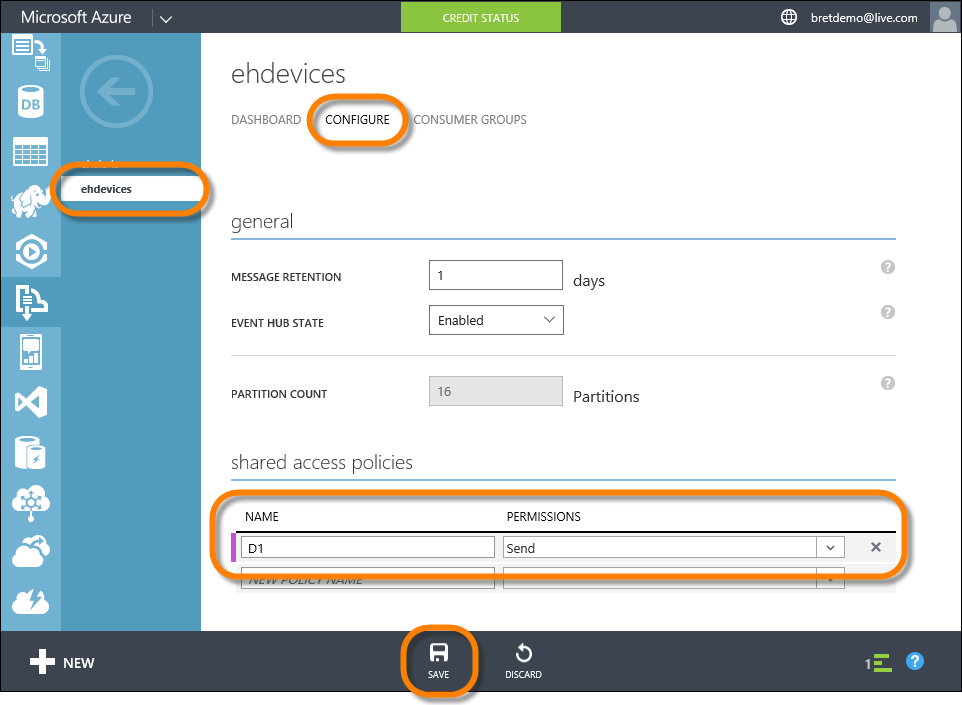
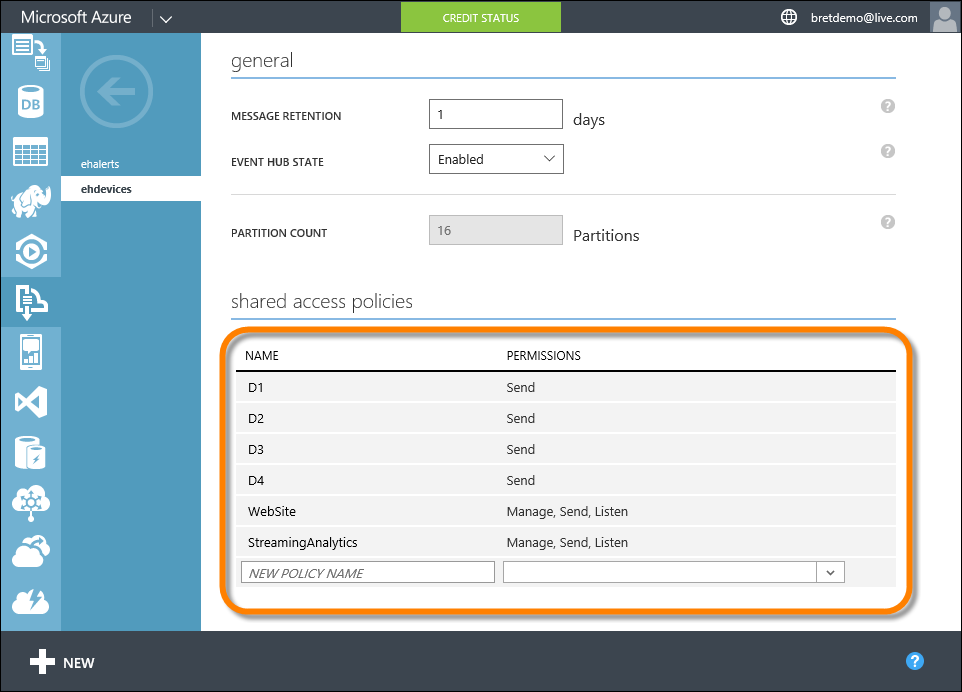

# "Azure Prep" Hands-On Lab #

---

## Overview ##

In this lab you will prepare your Azure subscription with the Service Bus namespace, event hubs, storage account and Stream Analytics jobs as required by the [ConnectTheDots.io](http://connectthedots.io) architecture:

In this lab, we'll focus on the Azure Service Bus, Event Hubs, and Stream Analytics components. The sample web site and device specific implementations are covered in other labs.  The components we create here are:

| Name                                   | Type                  | Use | 
| ---                                    | ---                   | --- |
| "***&lt;name&gt;*-ns**"                | Service Bus Namespace | Contains the Event Hubs | 
| "**ehdevices**"                        | Event Hub             | Receives messages from devices as well as the "***&lt;name&gt;*Aggregates**" Stream Analytics Job.  Messages sent to this event hub are later received by the sample website and displayed graphically in charts|
| "**ehalerts**"                         | Event Hub             | Receives alert messages generate by the alert Stream Analaytics jobs.  Those messages are then read by the sample website and used to display alerts about various sensor values | 
| "***&lt;name&gt;*Aggregates**"         | Stream Analytics Job  | Reads temperature messages from "**ehdevices**", averages them over 10 second windows, and outputs the resulting averages back into "**ehdevices**".  Those messages are later displayed in the sample website along with the detail temperature data. 
| "***&lt;name&gt;*&nbsp;&#42;&nbsp;**"  | Stream Analytics Jobs | Various jobs to read messages from "**ehdevices**" then generate alerts or other data to be output into the "**ehalerts**" event hub.  Those messages will then be used later by the sample website (or other downstream clients like Power BI) to display alerts data. 
| "***&lt;name&gt;*storage**"            | Storage Account       | Used by the Stream Analytics jobs for monitoring and logging purposes.  This is known as the "Regional Monitoring" storage account | 
 
---

## Prerequisites ##

To successfully complete this lab, you will need: 

- An active Azure Subscription.  If needed you can create a [free trial here](http://azure.microsoft.com/en-us/pricing/free-trial "Azure Free Trial").
- A computer with access to the Internet and a web browser
- A copy of the ConnectTheDots.io repository.  You can get the latest version [here](https://github.com/MSOpenTech/connectthedots/archive/master.zip "Connect the Dots Zip Download"). 

--

## Tasks ##

1. [Choose your "***&lt;name&gt;***" and "***&lt;region&gt;***"](#Task1)
2. [Create the "***&lt;name&gt;*-ns**" Azure Service Bus Namespace](#Task2)
3. [Create the "**ehdevices**" Event Hub](#Task3)
4. [Create the "**ehalerts**" Event Hub](#Task4)
5. [Create the "***&lt;name&gt;*storage**" Azure Storage Account](#Task5)
6. [Create the "***&lt;name&gt;**Aggregates*" Stream Analytics Job](#Task6)
7. [Create the "***&lt;name&gt;*&nbsp;&#42;&nbsp;**" Stream Analytics Job](#Task7)

---

<a name="Task1" />
## Task 1 - Choose your "***&lt;name&gt;***" and "***&lt;region&gt;***"##

Throughout this lab, you will be creating a number of resources in Azure.  Many of those resources require unique names.  In addition, when you are done with the lab you will likely want to delete the resources you provisioned during it.  To aid in both the uniqueness and later location of the azure resource you create we will use a standard "***&lt;name&gt;*___**" naming convention.  

For example, when creating our Service Bus Namespace in Task 2, we will use a name in the format of "***&lt;name&gt;*-ns**".  You need to pick an appropriate, short prefix for the "***&lt;name&gt;***" component.  
The name you choose needs to be:
- Less than 17 characters long (but shorter is better)
- Likely to be unique

A convenient solution may be to use a prefix of "**ctd**" (short for "**C**onnect **t**he **D**ots") followed by your first middle and last initial (or others as the case may be).  Again, an example:  If your name were "**J**ames **T**iberius **K**irk" you may choose a name prefix of "**ctdjtk**". Make sense?

For the rest of the lab, we will assume a name prefix of "**ctdhol**", short for "**Connect the Dots Hands-On Lab**".  You will need to pick something unique for yourself, and replace all subsequent occurrences of "***&lt;name&gt;***" with it.  

1. Pick your name prefix, and make a note of it.  
2. Help yourself out, and be consistent in its use.  

In addition to a unique name, you need to make sure to provision all of the resources you create in these labs in the same region.  

1. Review the list of [**Azure Regions**](http://azure.microsoft.com/en-us/regions/#Locations) ([http://azure.microsoft.com/en-us/regions](http://azure.microsoft.com/en-us/regions) , scroll down to the **"Locations"** heading) and choose a specific Azure Region to use consistently when ever you are presented with a choice in the labs. 

1. Note that at certain times, certain services may not be available in all regions.  For this lab, we are using "**South Central US**" as the region as we have verified that it currently supports all required services.  

---

<a name="Task2" />
## Task 2 - Create the "***&lt;name&gt;*-ns**" Azure Service Bus Namespace ##

1. In your web browser, open the ["**Azure Management Portal**"](https://manage.windowsazure.com) ([https://manage.windowsazure.com](https://manage.windowsazure.com)) and login to your subscription. 
1. Click on the "**Service Bus**" Icon along the left, then click the "**+CREATE**" button along the bottom to create a new Service Bus Namespace

	

2. In the "**CREATE A NAMESPACE**" window, complete the fields as described, then click the "**&#x2713;**" button

	| Field         | Value | 
	| ---           | ---   |
    |Namespace Name | "***&lt;name&gt;*-ns**" | 
    |Region         | "***&lt;region&gt;***" | 
    |Type           | "**MESSAGING**" | 
	|Messaging Tier | "**STANDARD**" | 

	

3. Wait until the new namespace's status shows as "**Active**", then click on the name of the new namespace to open it. 

	

---

<a name="Task3" />
## Task 3 - Create the "**ehdevices**" Event Hub ##

1. In the portal page for your newly created Service Bus Namespace, switch to the "**EVENT HUBS**" page, then click the "**+NEW**" button in the bottom left hand corner. 

	

2. In the "**NEW**" panel, select "**APP SERVICES**" | **"SERVICE BUS**" | "**EVENT HUB**" | "**QUICK CREATE**".  Complete the fields as described below, then click the "**CREATE A NEW EVENT HUB &#x2713;**" button.

	| Field         | Value | 
	| ---           | ---   |
    |Event Hub Name | "**ehdevices**" - You must use this name, without the quotes.  It is hard coded into multiple projects and would require significant effort to change | 
    |Region         | "***&lt;region&gt;***" | 
    |Namespace Name | "***&lt;name&gt;*-ns**" - The name you used when creating the namespace previously | 

	

3. Wait until the status of the "**ehdevices**" event hub shows as "**Active**" then click on the name of the event hub to open it.  

	

4. Click on the "**CONFIGURE**" page along the top, then, under the "**Shared Access Policies**" header, add a new Shared Access Policy named "**D1**" with "**Send"** permissions, then click "**SAVE**" to save it:

	

4. Repeat the previous steps to create the following Shared Access Policies.  Make sure to click the "**SAVE**"" button when you are done!

	| Name               | Permissions        | Purpose | 
	| ---                | ---                | ---     |
    | D1                 | Send               | Used by the first devices to send messages into the event hub        |  
    | D2                 | Send               | Used by a second optional device to send messages into the event hub |  
    | D3                 | Send               | Used by a third optional device to send messages into the event hub  |  
    | D4                 | Send               | Used by a fourth optional device to send messages into the event hub |
    | WebSite            | Manage,Send,Listen | Used by the sample web site to read messages from devices chart them |  
    | StreamingAnalytics | Manage,Send,Listen | Used by multiple Stream Analytics jobs to read devices messages for further processing |  

5. Again, make sure to click the "**SAVE**" button.  When you are done, your list of Shared Access Policies for the "**ehdevices**" event hub should match the following:

	
  
 

---

<a name="Task4" />
## Task 4 - Create the "**ehalerts**" Event Hub ##

---

<a name="Task5" />
## Task 5 - Create the "***&lt;name&gt;*storage**" Azure Storage Account ##

---

<a name="Task6" />
## Task 6 - Create the "***&lt;name&gt;**Aggregates*" Stream Analytics Job ##

---

<a name="Task7" />
## Task 7 - Create the "***&lt;name&gt;*&nbsp;&#42;&nbsp;**" Stream Analytics Job ##
