# "Conntect the Dots Sample Web Site" Hands-On Lab #

---

## Overview ##

In this lab you will deploy the sample website provided in the [ConnectTheDots.io](http://connectthedots.io) repository to Azure.  

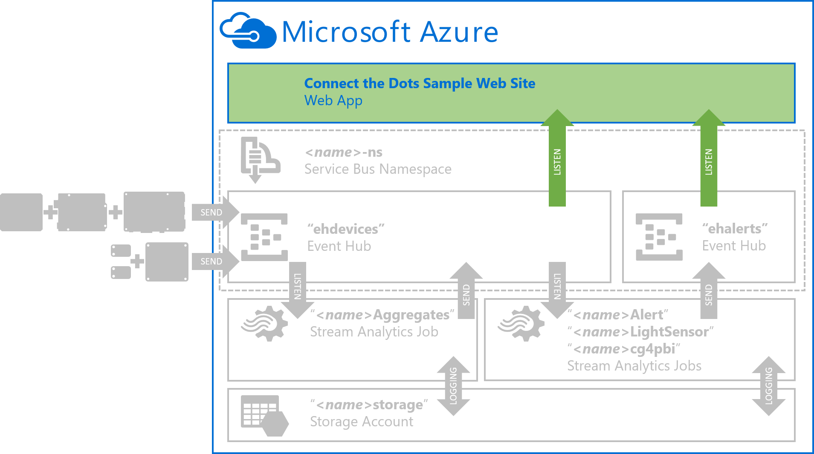 

For this lab, we'll focus on just publishing the sample web site to Azure.  The Event Hubs, Streaming Analytics, and device implementations are covered in other labs.  

---

## Prerequisites ##

To successfully complete this lab, you will need: 

- An active Azure Subscription.  If needed you can create a [free trial here](http://azure.microsoft.com/en-us/pricing/free-trial "Azure Free Trial").
- A Windows computer with [Visual Studio 2013 Community Edition](https://www.visualstudio.com/en-us/products/visual-studio-community-vs.aspx "VS2013 Community Edition Download") or better
- The Azure SDK 2.6 or later installed for Visual Studio 2013 ([Download if needed](http://go.microsoft.com/fwlink/p/?linkid=323510&clcid=0x409))
- A copy of the ConnectTheDots.io repository.  You can get the latest version [here](https://github.com/MSOpenTech/connectthedots/archive/master.zip "Connect the Dots Zip Download"). 
- In addition you need to have successfully completed the ["Azure Prep" HOL](/HOLs/Azure/AzurePrep).  


--

## Tasks ##

1. [Task 1 - Recall your "***&lt;name&gt;***" and "***&lt;region&gt;***" ](#Task1)
1. [Task 2 - Edit the Web.config File](#Task2)
1. [Task 3 - Publish the Web Site to Azure](#Task3)
1. [Task 4 - Enable WebSockets](#Task4)

---

<a name="Task1" />
## Task 1 - Recall your "***&lt;name&gt;***" and "***&lt;region&gt;***" ##

This lab requires that you have successfully completed the ["Azure Prep" HOL](/HOLs/Azure/AzurePrep).  In Task 1 of that lab ["**Choose your "*&lt;name&gt;*" and "*&lt;region&gt;*"**](/HOLs/Azure/AzurePrep/#Task1) you selected a name prefix to use in place of all "***&lt;name&gt;***" place holders throughout these labs.  You should use the same prefix here.

Additionally, you selected a target Azure "***&lt;region&gt;***" in which all resources were to be created.  Again, you should continue to use that same region here.  

---

<a name="Task2" />
## Task 2 - Edit the Web.config File ##

In this task we will modify the sample Web Site project's **web.config** file by adding the appropriate connection strings to the Azure Service Bus, Event Hubs, and Storage Account we created in the ["Azure Prep" HOL](/HOLs/Azure/AzurePrep).

1. Open the [/Azure/WebSite/ConnectTheDotsWebSite.sln](/Azure/WebSite/ConnectTheDotsWebSite.sln) Solution in Visual Studio 2013 Community Edition.
2. From the Visual Studio menu bar, select "**BUILD**" | "**Rebuild Solution**"

	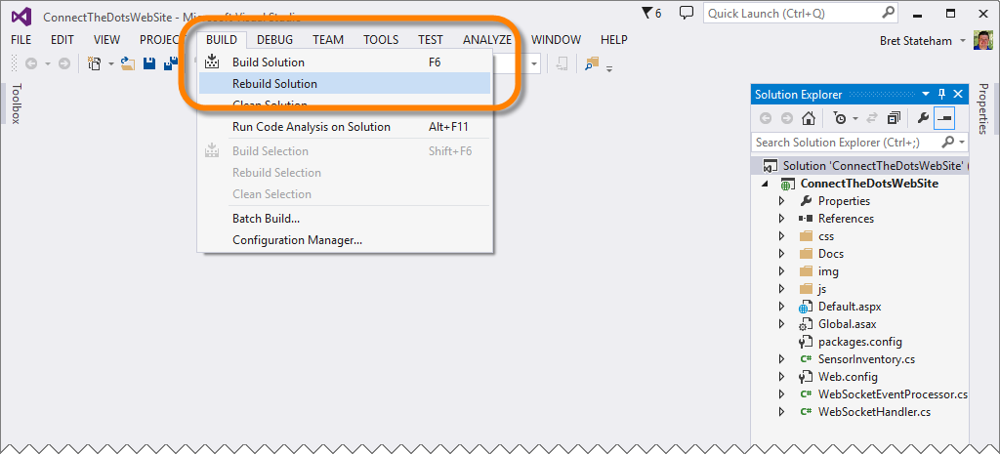

3. You should see a number of NuGet packages being restored

	

4.  When it is done rebuilding, verify that the rebuild all was successful by looking in the lower left corner of the Visual Studio window:

	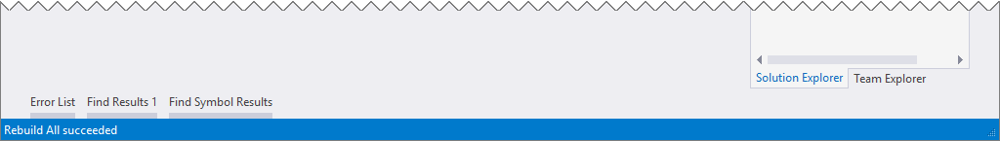

5.  In the Visual Studio "**Solution Explorer**" window, double-click on the "**Web.config**" file to open it in the editor. 

	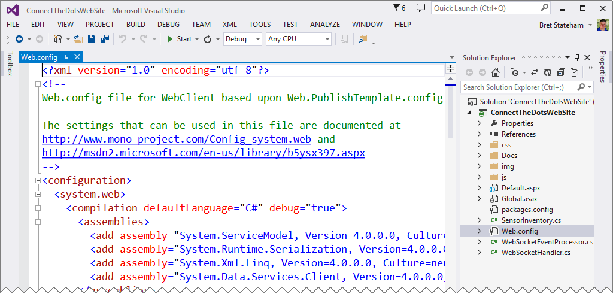

6. Locate the section of the Web.config file (should be around line 36) that starts with:

	```XML
	<!-- ================================================================================ -->
	<!-- Connect the Dots Connection Strings                                              -->
	<!-- ================================================================================ -->
	```

7. Verify that the event hub names, "**ehdevices**" and "**ehalerts**" match what you created in the ["Azure Prep" HOL](/HOLs/Azure/AzurePrep).  If you used different names, update them in the following section:

	```XML
	<!-- Event Hub Names --> 
	<!-- Leave these unchanged unless you named your event hubs something different -->
	<add key="Microsoft.ServiceBus.EventHubDevices" value="ehdevices" />
	<add key="Microsoft.ServiceBus.EventHubAlerts" value="ehalerts" />
	```

8. Next, locate the "**Service Bus Namespace Connection String**"

	```XML
	<!-- Service Bus Namespace Connection String -->
	<add key="Microsoft.ServiceBus.ConnectionString" value="Endpoint=sb://{namespace-name}.servicebus.windows.net/;SharedAccessKeyName=RootManageSharedAccessKey;SharedAccessKey={key}" />
	```

9. To find the replacement values for the "**{namespace-name}**" and "**{key}**" place holders in the connection string: 
	- In your web browser, go to the [Azure Management Portal](https://manage.windowsazure.com) (https://manage.windowsazure.com) and login to your account
	- Along the left hand side, click "**SERVICE BUS**" then click on the "***&lt;name&gt;*-ns**" Service Bus Namespace you created in the ["Azure Prep" HOL](/HOLs/Azure/AzurePrep).  
	- Switch to the "**CONFIGURE**" page
	- Under the "**shared access key generator**" heading, in the "**POLICY NAME**" drop-down, select the "**RootManageSharedAccessKey**" (this is key gives the holder full access to the Service Bus Namespace).
	- Next to the "**PRIMARY KEY**" field, click the copy button to copy the key to the clipboard.

	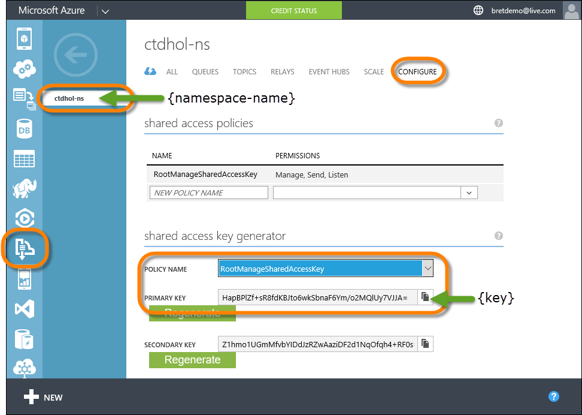


10. Use the namespace name ("***&lt;name&gt;*-ns**") and "**PRIMARY KEY**" values from the portal to update the "**Service Bus Namespace Connection String**":

	```XML
	<!-- Service Bus Namespace Connection String -->
	<add key="Microsoft.ServiceBus.ConnectionString" value="Endpoint=sb://ctdhol-ns.servicebus.windows.net/;SharedAccessKeyName=RootManageSharedAccessKey;SharedAccessKey=HapBPlZf+sR8fdKBJto6wkSbnaF6Ym/o2MQlUy7VJJA=" />
	```


11. Next, find the "**ehdevices Event Hub Connection String**"

	```XML
	<!-- ehdevices Event Hub Connection String --> 
	<add key="Microsoft.ServiceBus.ConnectionStringDevices" value="Endpoint=sb://{namespace-name}.servicebus.windows.net/;SharedAccessKeyName=WebSite;SharedAccessKey={key}" />
	```

12. To find the replacement values for the "**{namespace-name}**" and "**{key}**" place holders in the connection string: 
	- In your web browser, go to the [Azure Management Portal](https://manage.windowsazure.com) (https://manage.windowsazure.com) and login to your account
	- Along the left hand side, click "**SERVICE BUS**" then click on the "***&lt;name&gt;*-ns**" Service Bus Namespace you created in the ["Azure Prep" HOL](/HOLs/Azure/AzurePrep).  
	- Switch to the "**EVENT HUBS*"" page
	- Click on the name of the "**ehdevices**" event hub to open it
	- Switch to the "**CONFIGURE**" page
	- Under the "**shared access key generator**" heading, in the "**POLICY NAME**" drop-down, select the "**WebSite**" (this is they key associated with the Shared Access Policy we created previously)
	- Next to the "**PRIMARY KEY**" field, click the copy button to copy the key to the clipboard.

	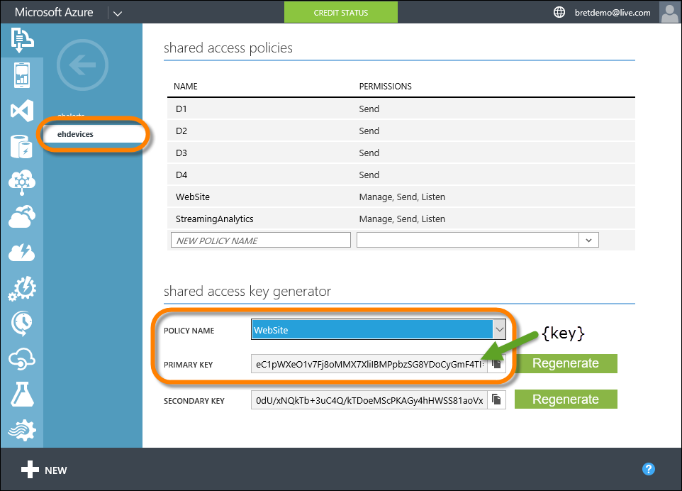


13. Use the same "**{namespace-name}**" place holder as before  ("***&lt;name&gt;*-ns**"), and the "**PRIMARY KEY**" for the "**ehdevices**" "**WebSite**" policy to update the "**ehdevices Event Hub Connection String**"
	
	```XML
	<!-- ehdevices Event Hub Connection String --> 
	<add key="Microsoft.ServiceBus.ConnectionStringDevices" value="Endpoint=sb://ctdhol-ns.servicebus.windows.net/;SharedAccessKeyName=WebSite;SharedAccessKey=eC1pWXeO1v7Fj8oMMX7XliIBMPpbzSG8YDoCyGmF4TI=" />
	```

11. Next, find the "**ehalerts Event Hub Connection String**"

	```XML
	<!-- ehalerts Event Hub Connection String --> 
	<add key="Microsoft.ServiceBus.ConnectionStringAlerts" value="Endpoint=sb://{namespace-name}.servicebus.windows.net/;SharedAccessKeyName=WebSite;SharedAccessKey={key}" />
	```

12. To find the replacement values for the "**{namespace-name}**" and "**{key}**" place holders in the connection string: 
	- In your web browser, go to the [Azure Management Portal](https://manage.windowsazure.com) (https://manage.windowsazure.com) and login to your account
	- Along the left hand side, click "**SERVICE BUS**" then click on the "***&lt;name&gt;*-ns**" Service Bus Namespace you created in the ["Azure Prep" HOL](/HOLs/Azure/AzurePrep).  
	- Switch to the "**EVENT HUBS*"" page
	- Click on the name of the "**ehalerts**" event hub to open it
	- Switch to the "**CONFIGURE**" page
	- Under the "**shared access key generator**" heading, in the "**POLICY NAME**" drop-down, select the "**WebSite**" (this is they key associated with the Shared Access Policy we created previously)
	- Next to the "**PRIMARY KEY**" field, click the copy button to copy the key to the clipboard.

	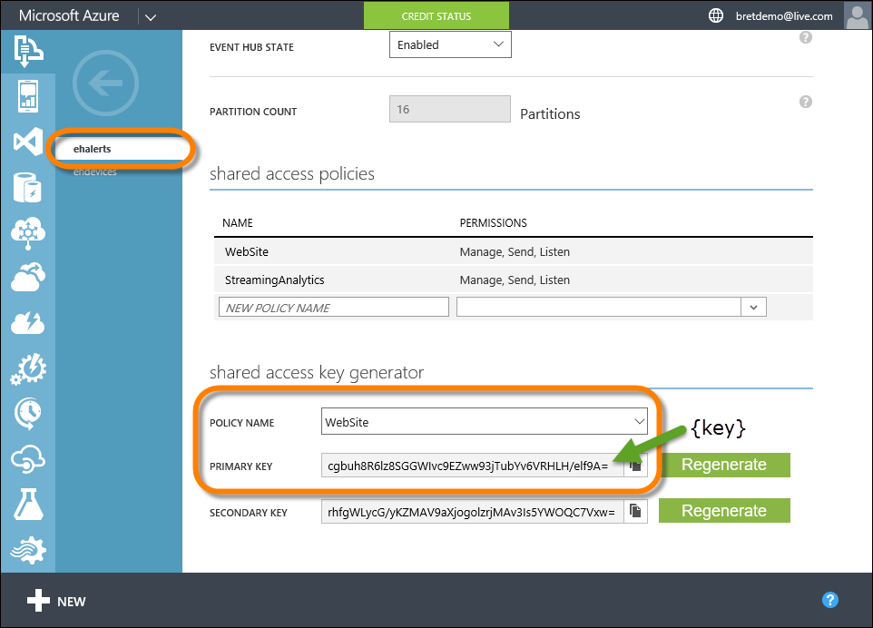


13. Use the same "**{namespace-name}**" place holder as before  ("***&lt;name&gt;*-ns**"), and the "**PRIMARY KEY**" for the "**ehalerts**" "**WebSite**" policy to update the "**ehalerts Event Hub Connection String**"
	
	```XML
	<!-- ehalerts Event Hub Connection String --> 
	<add key="Microsoft.ServiceBus.ConnectionStringAlerts" value="Endpoint=sb://ctdhol-ns.servicebus.windows.net/;SharedAccessKeyName=WebSite;SharedAccessKey=cgbuh8R6lz8SGGWIvc9EZww93jTubYv6VRHLH/elf9A=" />
	```

14. Finally, locate the "**Regional Monitoring Storage Account Connection String**"

	```XML
	<!-- Regional Monitoring Storage Account Connection String --> 
	<add key="Microsoft.Storage.ConnectionString" value="DefaultEndpointsProtocol=https;AccountName={storageaccount};AccountKey={key}" />
	```

15. To locate the replacement values for the "**{stroageaccount}**" and "**{key}**" place holders in the connection string:

	- In your web browser, go to the [Azure Management Portal](https://manage.windowsazure.com) (https://manage.windowsazure.com) and login to your account
	- Along the left hand side, click "**STORAGE**" then click on the "***&lt;name&gt;*storage**" Storage Account you created in the ["Azure Prep" HOL](/HOLs/Azure/AzurePrep).  
	- Click on the "**MANAGE ACCESS KEY**" button along the bottom
	- In the "**Manage Access Keys**" Window, copy the "**STORAGE ACCOUNT NAME**" and "**PRIMARY ACCESS KEY**" values

	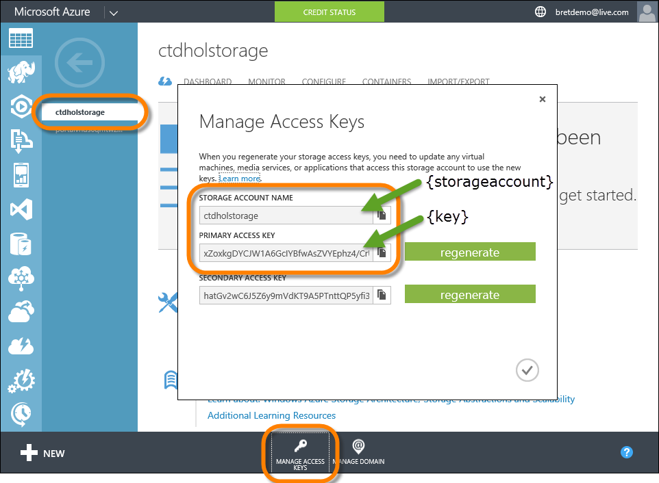
 
16. Use the "**STORAGE ACCOUNT NAME**" and "**PRIMARY ACCESS KEY**" values copied from above to replace the "**{storageccount}**" and "**{key}**" place holders in the "**Regional Monitoring Storage Account Connection String**":

	```XML
	<!-- Regional Monitoring Storage Account Connection String --> 
	<add key="Microsoft.Storage.ConnectionString" value="DefaultEndpointsProtocol=https;AccountName=ctdholstorage;AccountKey=xZoxkgDYCJW1A6GcIYBfwAsZVYEphz4/CrURgZb+8idzDCut/Om047d0r8KDsgNU+0W6zWhjA4b/rB3MOxX0yg==" />
	```

17.  From the Visual Studio menu bar, select "**FILE**" | "**Save All**" to save your changes
18.  Then, from the Visual Studio menu bar, select "**BUILD**" | "**Build Solution**" and verify that the build succeeds:

	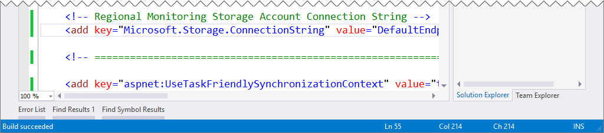

---

<a name="Task3" />
## Task 3 - Publish the Web Site to Azure ##

1. Ensure that the "**ConnectTheDotsWebSite**" solution still open in Visual Studio 2013.
2. In the Visual Studio "**Solution Explorer**" window, right click on the "**ConnectTheDotsWebSite**" project, and select "**Publish...**" from the pop-up menu:

	

3. In the "**Publish Web**" window, select "**Microsoft Azure Web Apps**"

	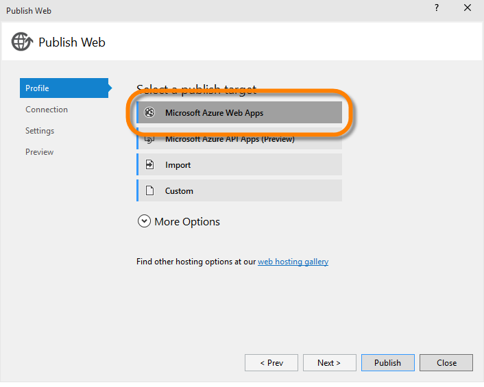

4. In the "**Select Exsiting Web App**" window, if you haven't already signed into your azure account, click the "**Sign In...*" button, and login with the credentials for your Azure account.

	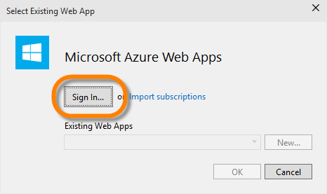

5. Once signed in, in the "**Select Existing Web App**" window, click the "**New...**" button to create a new Azure Web App.

	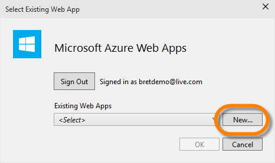
  
6. In the "**Create Web App on Azure**" window, complete the fields as described below, then click the "**Create**" button (a new, empty, Web App will be created in Azure when you click the "**Create**" button):

	| Field           | Value                           |
    | ---             | ---                             |
    | Web app name    | "***&lt;name&gt;*web**"         | 
    | App Service plan| **Create new App Service plan** |
    |                 | "***&lt;name&gt;*plan**"        |
    | Resource Group  | **Create new resource group**   | 
    |                 | "***&lt;name&gt;*group**"       |
    | Region          | "***&lt;region&gt;***"          | 
    | Database server | **No database**                 | 

	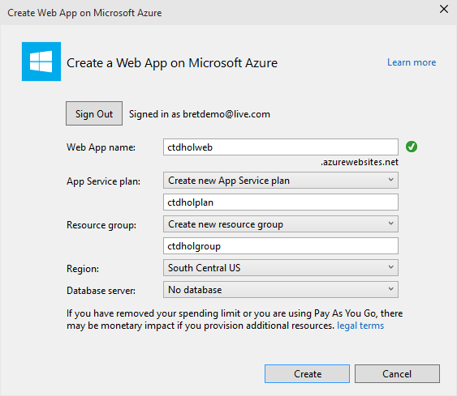

7. Back in the "**Publish Web**" window, on the "**Connection**" page, click the "**Validate Connection**" to verify that you can connect to the new web app, then click "**Next >**":

	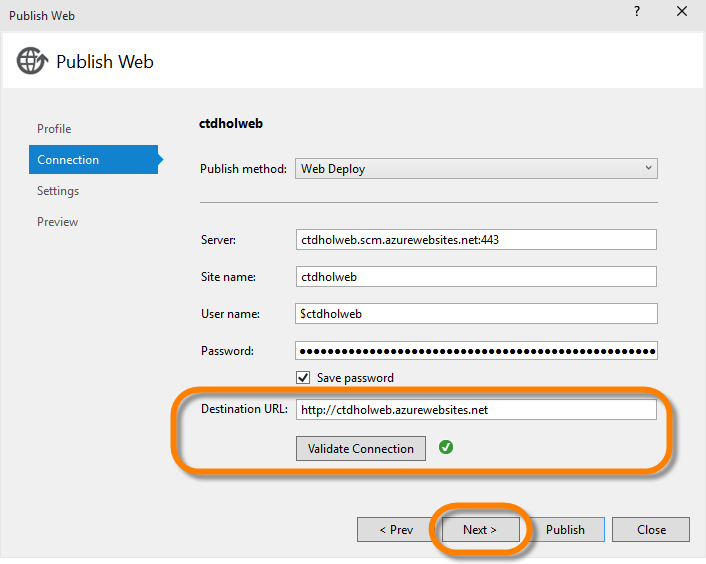

8. On the "**Settings**" page, accept the defaults, and click "**Next >**"

	

9. On the "**Preview**" page, click the "**Publish**" button

	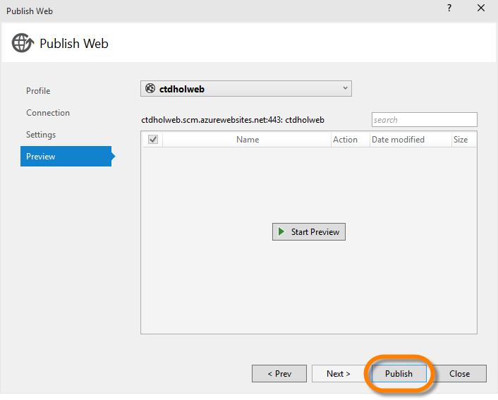

10. In the Visual Studio "**Azure App Service Activity**" Window (or in the "**Output**" window), you can monitor your publish activity.  When the publish is finished, you should see a link to your new Azure Web App:

	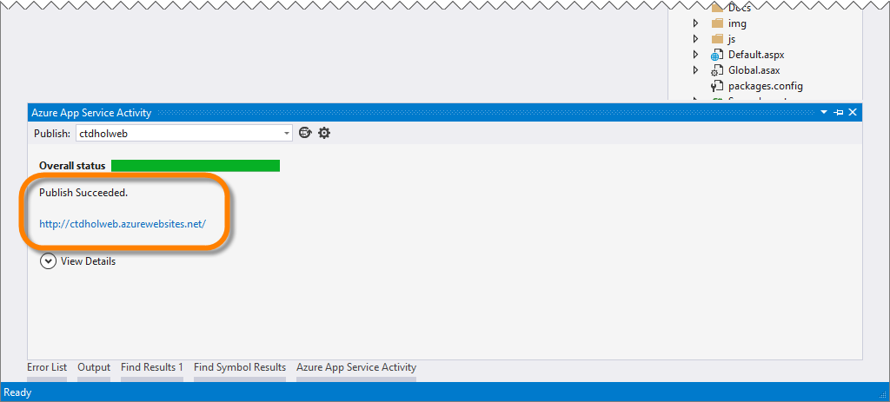

11. You can click on the link to open the new site in the browser (if it didn't open automatically when the publish completed).  When you do, you should see an error message displayed at the bottom (yes, we expect this error).  We'll fix this error in the next task.: 

	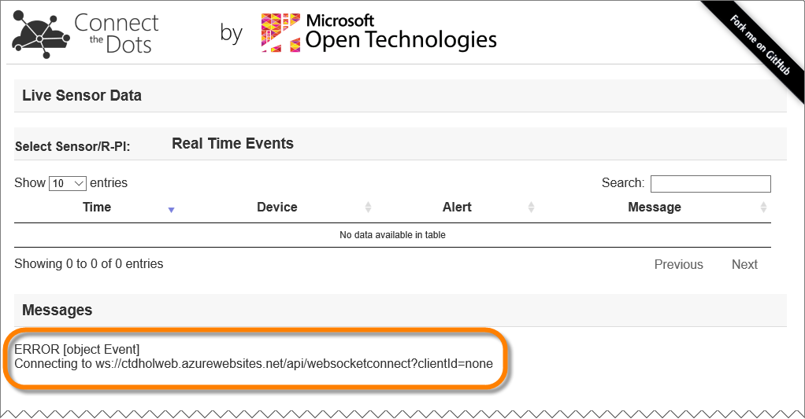

---

<a name="Task4" />
## Task 4 -Enable WebSockets  ##

As you saw at the end of the previous task, the website is receiving an error related to WebSockets.  The web app receives events from the "**ehdevices**" and "**ehalerts**" event hubs, then published them to the [d3js](http://d3js.org) graphics library via web sockets.  In order for that to work, we need to enable Web Socket functionality in the new Web App we just created. 

1. In your web browser, open the [Azure Management Portal](https://manage.windowsazure.com) (https://manage.windowsazure.com) and login to your account. 
2. In the list of services along the left, click "**WEB APPS**", then click on the name of the web app you just created in Visual Studio to open it:

	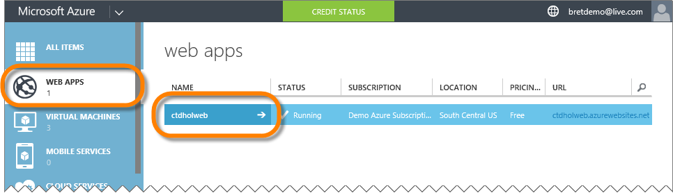

3. Switch to the "**CONFIGURE**" page, and under the "**general**" heading, scroll down to find the "**WEB SOCKETS**" setting.  Click "**ON**" to enable Web Sockets, then click the "**SAVE**" button along the bottom to save the changes.

	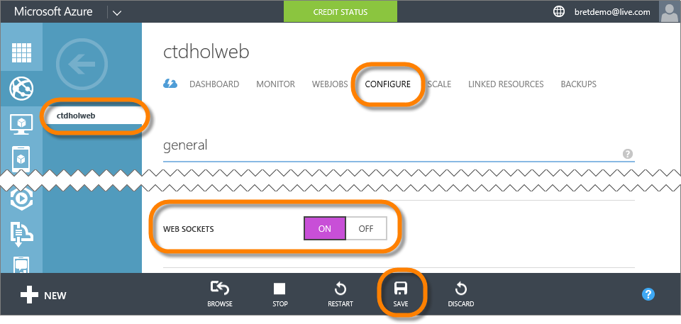
  
4. Finally, return to the website and refresh it, and verify that the error is gone, and that the page has now successfully connected to itself via web sockets:

	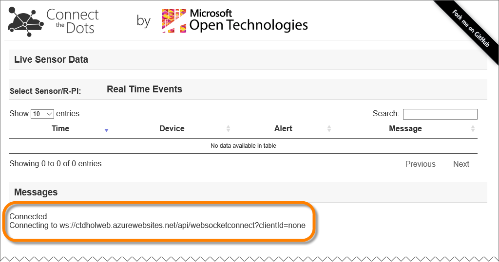