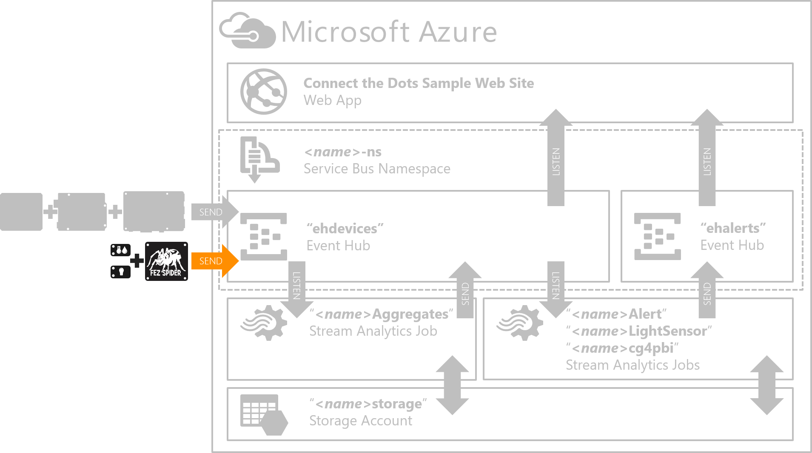
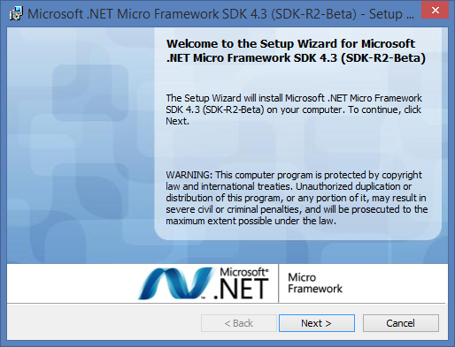
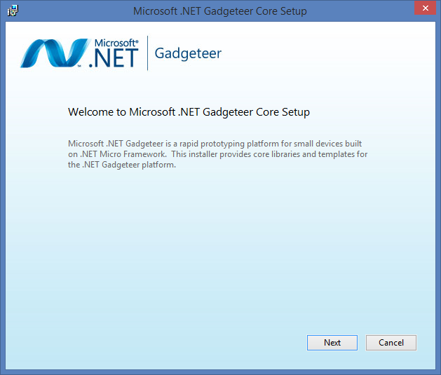
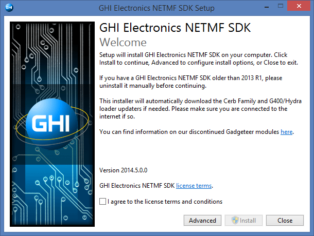
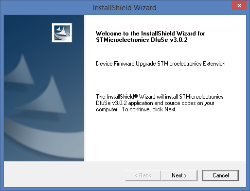
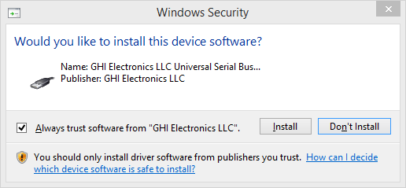
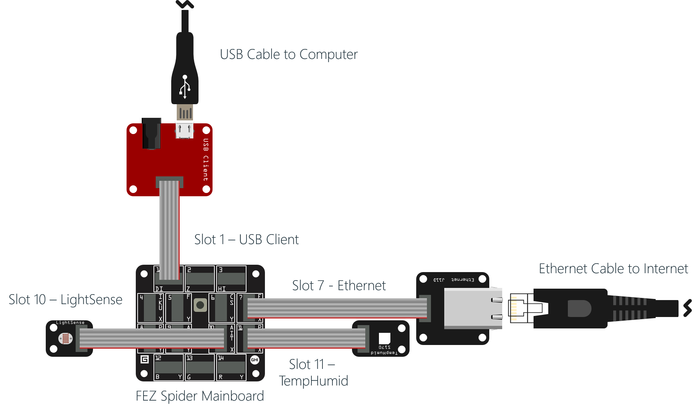

# "NETMF Gadgeteer Configuration" Hands-On Lab #

---

## Overview ##

In this lab you will use A Gadgeteer FEZ Spider and the [.NET Micro Framework](http://netmf.codeplex.com/) to publish sensor data into the "**ehdevices**" Azure Event Hub you created previously in the "**Azure Prep**" Hands-On Lab.  

---

## Prerequisites ##

To successfully complete this lab, you will need: 

- An active Azure Subscription.  If needed you can create a [free trial here](http://azure.microsoft.com/en-us/pricing/free-trial "Azure Free Trial").
- A Windows computer with Visual Studio 2013 Community Edition or better [download](http://go.microsoft.com/?linkid=9863608).  **NOTE: YOU CAN'T USE VISUAL STUDIO 2015 FOR THIS LAB.  IT MUST BE VISUAL STUDIO 2013.**  
- A copy of the ConnectTheDots.io repository.  You can get the latest version [here](https://github.com/MSOpenTech/connectthedots/archive/master.zip "Connect the Dots Zip Download"). 
- You will need to download and install the software components covered in the "**Install Dependencies**" task

 - .NET Framework 3.5.  This is included as a Windows Feature, but you need to verify that it is "On"
 - [.Net Micro Framework Core SDK](http://netmf.codeplex.com/downloads/get/911182)
 - [.Net MF Visual Studio 2013 integration](http://netmf.codeplex.com/downloads/get/911183)
 - [.Net Gadgeteer Core](http://gadgeteer.codeplex.com/downloads/get/918081)
 - [GHI NETMF and Gadgeteer package](https://www.ghielectronics.com/support/netmf/sdk/24/netmf-and-gadgeteer-package-2014-r5)

- You will need a FEZ Spider and the additional hardware components covered in the "**Connect the Components to the FEZ Spider Mainboard**" task. 

 - [Gadgeteer FEZ Spider Mainboard](https://www.ghielectronics.com/catalog/product/269)
 - [Gadgeteer USB DP Module](https://www.ghielectronics.com/catalog/product/280)
 - [Gadgeteer Ethernet J11D Module](https://www.ghielectronics.com/catalog/product/284)
 - [Gadgeteer TempHumid S170 Module](https://www.ghielectronics.com/catalog/product/528)
 - [Gadgeteer LightSense Module](https://www.ghielectronics.com/catalog/product/336)

---

## Tasks ##

1. [Install Dependencies](#Task1)
1. [Connect the Components to the FEZ Spider Mainboard](#Task2)
1. [Modify and Deploy the ConnectTheDotsGadgeteer Project](#Task3)
1. [Verify Your Results](#Task4)

---

## Task 1

To complete this lab you will need Visual Studio 2013 Community Edition or better.  At the time this is being written, Visual Studio 2015 is NOT supported so you will need VS 2013.  The free Community Edition works fine, but if you already have a VS 2013 Professional or VS 2013 Ultimate, those work just fine as well. 

You need to install the .NET Micro Framework SDK, and a few additional tools to help Visual Studio work with NETMF and the Gadgeteer boards.    

1. Verify that the .NET Framework 3.5 is enabled on your system.   To do so, go to your "**Control Panel**" | "**Programs**" | "**Turn Windows features on or off**" and ensure that the .NET Framework 3.5 is enabled.  You do not need the Windows Communication Foundation Activation features enabled.  

	

1. Download and install the [.Net Micro Framework Core SDK 4.3 (SDK-R2-Beta)](http://netmf.codeplex.com/downloads/get/911182)

	

2. Download and install the [.Net MF Visual Studio 2013 integration](http://netmf.codeplex.com/downloads/get/911183)

	

3. Download and install the [.Net Gadgeteer Core](http://gadgeteer.codeplex.com/downloads/get/918081)

	

4. Finally, download and install the [GHI NETMF and Gadgeteer package](https://www.ghielectronics.com/support/netmf/sdk/24/netmf-and-gadgeteer-package-2014-r5)  This installer actually calls other installers.  You need to pay attention as you run through this because you will need to answer the prompts for:

	

	- The nested "**Atmel SAM Boot Assistant**" ("**SAM-BA**") installer:

		

	- The ST Microelectronics "**Device Firmware Upgrade ST Microelectronics Extension**" ("**DfuSe**") isntaller:

		

	- GHI USB Driver:

		

5. Make sure that you complete all of the required installs.  If you miss one, you will not be able to complete the lab. 

---

## Task 2 - Connect the Components to the FEZ Spider Mainboard ##

One of the benefits of the Gadgeteer platform is the ease with which you can connect components.  In this task, you need to simply connect the components as described below:

1. Connect the [Gadgeteer LightSense Module](https://www.ghielectronics.com/catalog/product/336) to **Slot 10** on the FEZ Spider Mainboard.
2. Connect the [Gadgeteer TempHumid S170 Module](https://www.ghielectronics.com/catalog/product/528) to **Slot 11** on the FEZ Spider Mainboard
3. Connect the [Gadgeteer Ethernet J11D Module](https://www.ghielectronics.com/catalog/product/284) to** Slot 7** on the FEZ Spider Mainboard
4. Connect the [Gadgeteer USB DP Module](https://www.ghielectronics.com/catalog/product/280) to **Slot 1** on the FEZ Spider Mainboard

---

## Task 3 - Modify and Deploy the ConnectTheDotsGadgeteer Project ##

---

## Task 4 - Verify Your Results ##

