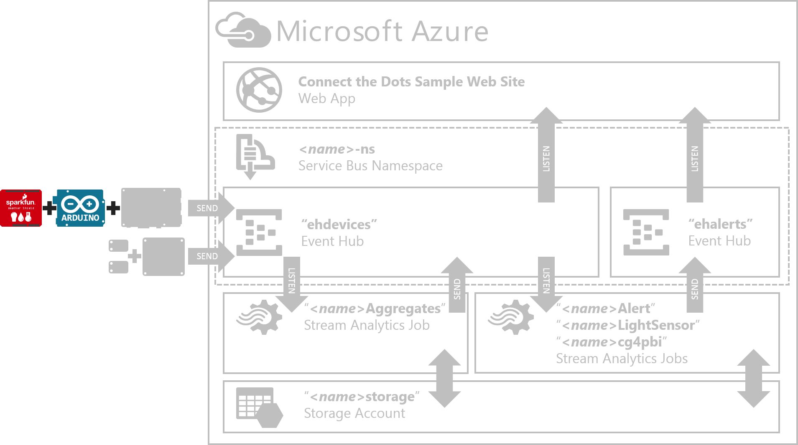
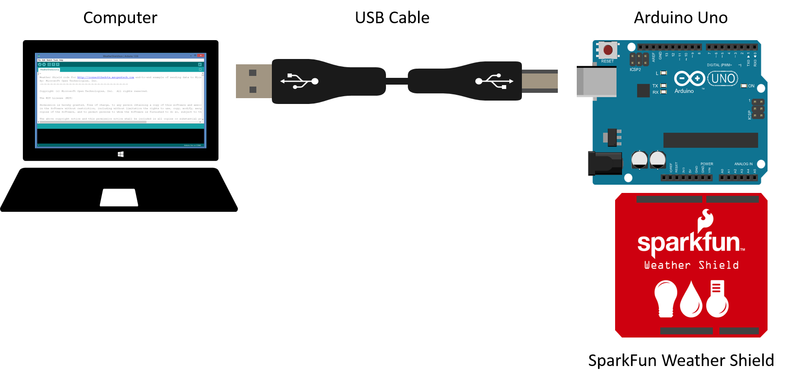
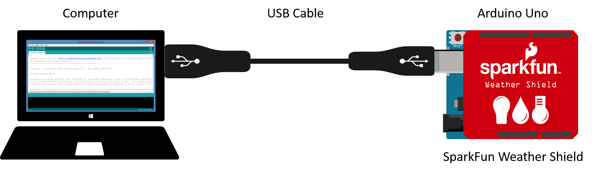
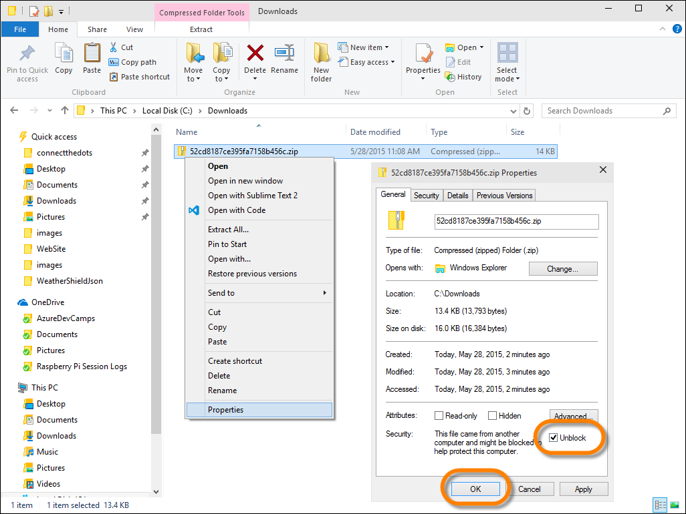
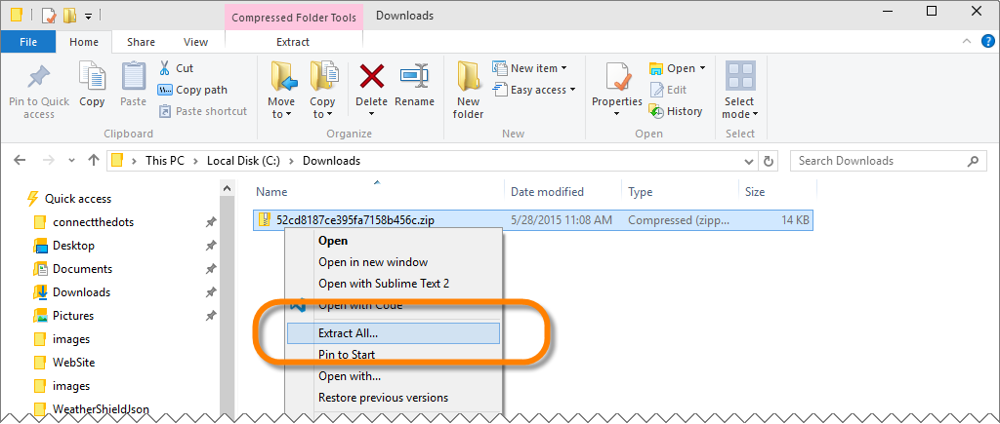
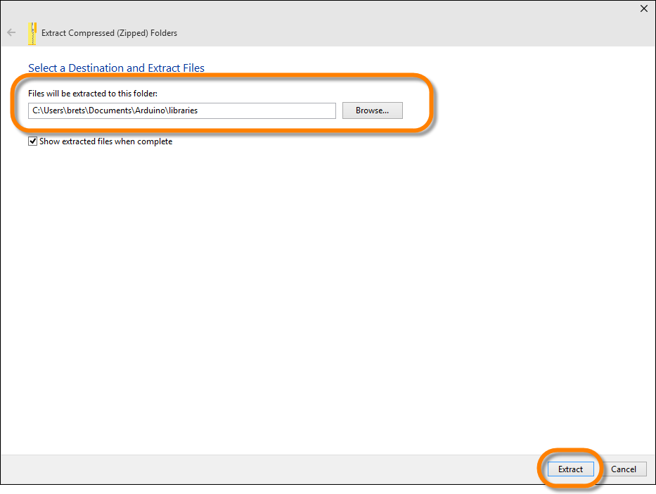
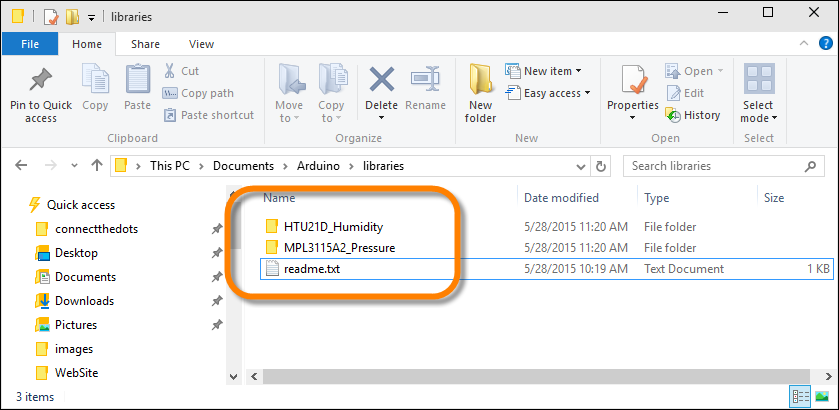
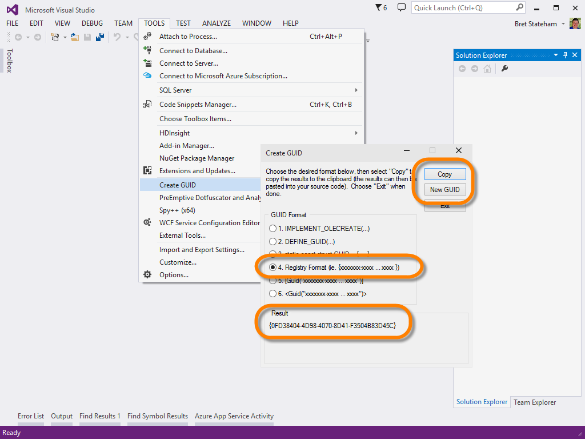
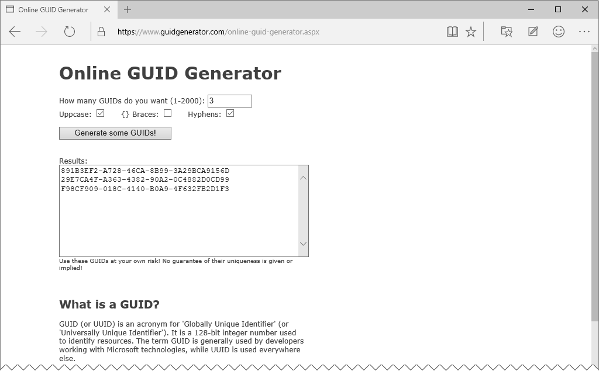
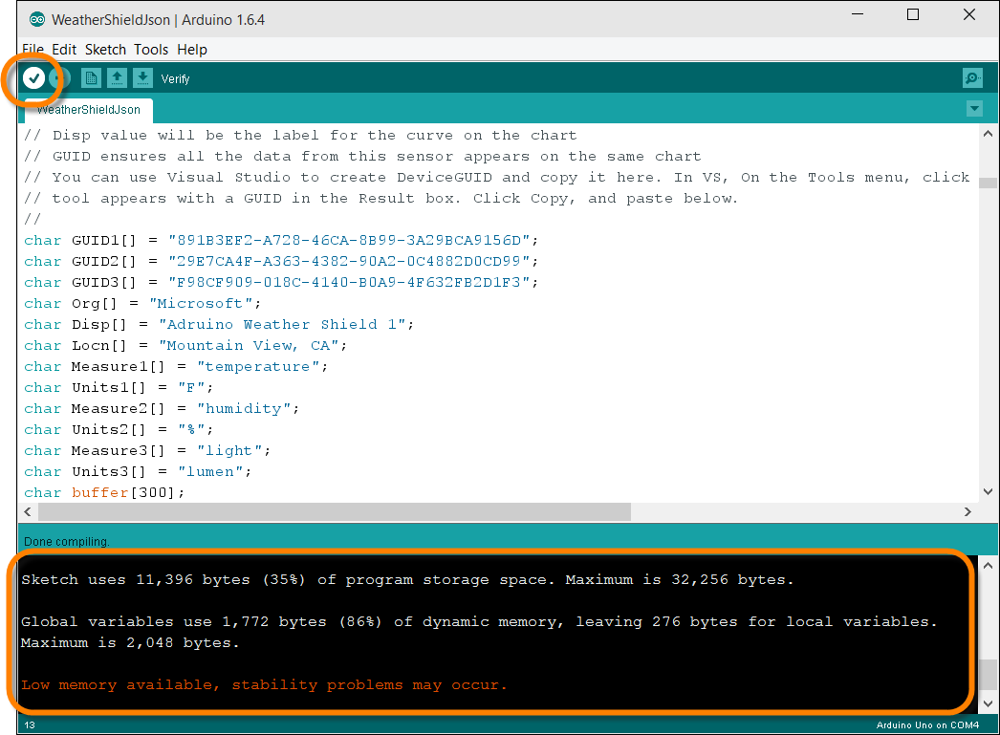

# "Arduino Uno With SparkFun Weather Shield" Hands-On Lab #
---

## Overview ##

In this lab, we'll deploy code to an Arduino Uno that reads sensor data (Temperature, Humidity, and Light) from a SparkFun Weather Shield.  



The Arduino Uno is an extremely popular micro-controller platform. It has a fantastic community around it, and a staggering array of 3rd party components, actuators, sensors, and "shields" that work with it.  

However, when it comes to the "Internet of Things", the Arduino has some limitations

- It has relatively low processing power and memory.  
- It has not built-in communication capabilities other that Serial.   

The limitied processing power makes it difficult for it to participate in the secure protocols (AMQPS, HTTPS, SSL, etc) that enterprise grade IoT solutions require.

The limited communications means that we need to either add communication capabilities to it (like WiFi, Ethernet, Bluetooth, etc) , or better yet we could  connect it via a USB-to-Serial connection to a more powerful "gateway" device which handles the secure protocols and Internet communications. 

In this lab, we'll implement the code that allows the Arduino to read and package Sensor data, the publish it over a serial connection.  We'll then connected it to a Raspberry Pi "Gateway" via a USB-to-Serial connection and allow the Raspberry Pi to encrypt and transmit the messages to Azure.  We'll implement the Raspberry Pi Gateway Service in another lab.  
 
---

## Prerequisites ##

To successfully complete this lab, you will need: 

- An active Azure Subscription.  If needed you can create a [free trial here](http://azure.microsoft.com/en-us/pricing/free-trial "Azure Free Trial").

- A copy of the ConnectTheDots.io repository.  You can get the latest version [here](https://github.com/MSOpenTech/connectthedots/archive/master.zip "Connect the Dots Zip Download"). 

- An Arduino Uno ([link](http://www.arduino.cc/en/Main/ArduinoBoardUno "Arduino Uno")) and a USB Cable

- As SparkFun Weather Shield ([link](https://www.sparkfun.com/products/12081 "SparkFun Weather Shield"))

- The Arduino IDE (You can download and install for free from http://www.arduino.cc/en/Main/Software)

- **OPTIONAL**: Read SparkFun's "[**Weather Shield Hookup Guide**](https://learn.sparkfun.com/tutorials/weather-shield-hookup-guide)"

---

## Tasks ##

1. [Connect the Arduino Uno and SparkFun Weather Shield to your computer](#Task1)
1. [Install the SparkFun Weather Shield Libraries](#Task2)
1. [Deploy and Test the WeatherShieldJson.ino Sketch](#Task3)
1. [Connect the Aduino UNO and SparkFun Weather Shield to the Raspberry Pi](#Task4)

---

<a name="Task1" />
## Task 1 - Connect the Arduino Uno and SparkFun Weather Shield to your computer ##

In this task, we'll connect the SparkFun Weather Shield to the Arduino Uno, then connect the Arduino Uno via USB to your computer.  

1. From your kit, identify the following components:

	- Arduino Uno
	- USB Cable
	- SparkFun Weather Shield (may already be plugged into the Arduino Uno)


	

2. **ENSURE THAT THE Arduino Uno IS NOT PLUGGED IN TO THE COMPUTER, OR A POWER SUPPLY**.  We don't want to connect or remove the shield from the Arduino Uno while it has power connected.  
 
3. If the SparkFun Weather Shield isn't already plugged into the Arduino Uno, do so.  Be careful to line the pins up on the SparkFun Weather Shield with the headers on the Arduino Uno.  Notice that the pins only match when the SparkFun Weather Shield is properly oriented. 

4. Once the SparkFun Weather Shield is connected to the Arduino Uno, you can connect the USB Cable to the Arduino Uno and your computer.

	
 
5. The Arduino creates a USB-to-Serial connected over the USB cable to your computer.  You should have already installed the Arduino IDE (as stated in the Prerequisties).  When you did so, if you are on a Windows computer, the USB driver should have already been installed.  
6. You should be able to identify the COM port your Arduino Uno is connected on by opening your "**Device Manager**", expanding "**Ports (COM & LPT)**", and reviewing  the "**Arduino Uno**" entry.  In the screen shot below, you can see that on my computer, the Arduino Uno was connected on "**COM4**".  You need to identify the COM port your Arduino is connected on so you can select it later when you deploy code to it.

	


---

<a name="Task2" />
## Task 2 - Install the SparkFun Weather Shield Libraries ##

The SparkFun Weather Shield has a specific code library that the Arduino Sketch relies on.  In this task, we'll make sure that the library is installed on your computer so you can successfully compile and deploy the code to your Arduino. 

1. Download the SparkFun Weather Shield Libraries from [here](https://dlnmh9ip6v2uc.cloudfront.net/assets/b/5/9/7/f/52cd8187ce395fa7158b456c.zip)

1. If you are on a Windows computer, **BEFORE YOU EXTRACT THE .ZIP FILE**, unblock it by right clicking on the downloads zip file, selecting "**Properties**" from the pop-up menu, and then clicking the "**UNBLOCK**" button (in Windows 10 it is currently an "**Unblock**" checkbox):

	

2. Next, you need to extract the libraries to your "**\My Documents\Arduino\Libraries**" folder.  Right-click on the downloaded .zip file, and select "**Extract All...**" from the pop-up menu. 

	

3.  In the "**Extract Compressed (Zipped) Folders**" window, Click the "**Browse...**" button to locate your "**c:\\Users\\*&lt;YOUR USER NAME&gt;*\\Documents\\Arduino\\libraries**" folder, then click the "**Extract**" button.

	

4.  When the extraction is complete, verify that the "**HTU21D_Humidity**" and "**MPL3115A2_Pressure**" Library folders have been extracted:

	

---

<a name="Task3" />
## Task 3 - Deploy and Test the WeatherShieldJson.ino Sketch ##

1. On your computer, open the Arduino IDE
2. In the Arduino IDE, Open the [\Devices\GatewayConnectedDevices\Arduino UNO\Weather\WeatherShieldJson\WeatherShieldJson.ino](\Devices\GatewayConnectedDevices\Arduino UNO\Weather\WeatherShieldJson\WeatherShieldJson.ino) Arduino "Sketch".
3. Locate the `// Constants used for the ConnectTheDots project` section in the code (should be around line 60). 

	```c
	// Constants used for the ConnectTheDots project
	// Disp value will be the label for the curve on the chart
	// GUID ensures all the data from this sensor appears on the same chart
	// You can use Visual Studio to create DeviceGUID and copy it here. In VS, On the Tools menu, click Create GUID. The Create GUID
	// tool appears with a GUID in the Result box. Click Copy, and paste below.
	//
	char GUID1[] = "xxxxxxxx-xxxx-xxxx-xxxx-xxxxxxxxxxxx";
	char GUID2[] = "yyyyyyyy-yyyy-yyyy-yyyy-yyyyyyyyyyyy";
	char GUID3[] = "zzzzzzzz-zzzz-zzzz-zzzz-zzzzzzzzzzzz";
	char Org[] = "My organization";
	char Disp[] = "Arduino + WS dev 01";
	char Locn[] = "here";
	char Measure1[] = "temperature";
	char Units1[] = "F";
	char Measure2[] = "humidity";
	char Units2[] = "%";
	char Measure3[] = "light";
	char Units3[] = "lumen";
	```
 
4. Modify the values for the variables to reflect your organization, display name, location name, and GUIDs.  In this lab, we are retrieveing three sensor values (temperature, humidity, and light).  That is the reason for the three GUIDs values.  Each sensor is identified by a unique GUID.  

5. You can use Visual Studio to create GUIDs if you like (just remove the curly braces after you paste them in.

	
 
6.  Or you could also use an online GUID generator like http://www.guidgenerator.com:

	

7.  Here is a sample of some modified values in the source code, again, make sure to use your own values.  You do NOT however need to change the measure names and units unless you really want to! 

	```c
	char GUID1[] = "891B3EF2-A728-46CA-8B99-3A29BCA9156D";
	char GUID2[] = "29E7CA4F-A363-4382-90A2-0C4882D0CD99";
	char GUID3[] = "F98CF909-018C-4140-B0A9-4F632FB2D1F3";
	char Org[] = "Microsoft";
	char Disp[] = "Adruino Weather Shield 1";
	char Locn[] = "Mountain View, CA";
	char Measure1[] = "temperature";
	char Units1[] = "F";
	char Measure2[] = "humidity";
	char Units2[] = "%";
	char Measure3[] = "light";
	char Units3[] = "lumen";
	```

8.  Once you have completed your code modifications, In the Arduino IDE, "**Verify**" your code by clicking on the "**&#10003;**" button on the left side of the top toolbar:

	

9.  

---

<a name="Task4" />
## Task 4 - Connect the Aduino UNO and SparkFun Weather Shield to the Raspberry Pi ##

---


