# "Raspberry Pi Field Gateway" Hands-On Lab #

---

## Overview ##

In this lab, you will configure your Raspberry Pi 2 as a "Field Gateway".


A "Field Gateway" is a common solution for securing and transmitting data from lower powered microcontrollers, or those without direct network connectivity.   


In our scenario, we have the Arduino Uno with the SparkFun Weather Shield that we implemented in a previous lab.  The Arduino Uno is an awesome platform, but it does have a few real limitations:  

- Limited processing power and memory.  This makes it hard to communicate using secure protocols like HTTPS, or AMQPS where more intensive processing is required.   
- No built in remote communication capabilties.  You need to extend the Arduino with additional components for Ethernet, WiFi, Bluetooth, etc.  

Our solution here then is to connect the Arduino to our Raspberry Pi using a USB-to-Serial connection.  The Raspberry Pi can then receive the sensor data messages from the Arduino Uno over the serial connection, and then forward them on securely using HTTPS, or AMQPS over Ethernet or WiFi. 

---

## Alternative, More Hands-On Walkthrough ##

This Hands-On Lab is a simplified, and more streamlined version of the original Raspberry Pi gateway setup documentation.  In this lab, we assume you are at an event where a pre-configured Raspberry Pi image has already been applied to the SD Card in your Raspberry Pi.  

This pre-configured image already has

- Raspian operating system installed (via NOOBS)
- Mono
- WiFi Configuration
- The GatewayService .NET project already deployed

All you really need to do in this lab is:

- Remote into your Raspberry Pi via ssh or remote desktop
- Modify the GatewayService application configuration file with the path and keys to your "ehdevices" event hub
- Plug in your Arduino with SparkFun Weather Shield
- Sit back and watch the data flow! 

If you are at an event where the pre-configured image is available you may want to start with this lab, then if you have time and want to get more hands on with the Pi setup, you can wipe out the SD card and start over, following the documentation in the [Original Raspberry Pi Gateway Setup Docs](../../../../Devices/Gateways/GatewayService/RaspberryPi-Gateway-setup.md)

---

## Prerequisites ##

To successfully complete this lab, you will need: 

- An active Azure Subscription.  If needed you can create a [free trial here](http://azure.microsoft.com/en-us/pricing/free-trial "Azure Free Trial").

- A copy of the ConnectTheDots.io repository.  You can get the latest version [here](https://github.com/MSOpenTech/connectthedots/archive/master.zip "Connect the Dots Zip Download"). 

- An ssh client (like [PuTTY](http://www.chiark.greenend.org.uk/~sgtatham/putty/download.html "PuTTY Downloads") on Windows)
  
- A Raspberry Pi 2 with a USB WiFi adapter

- A copy of the Raspberry Pi image on an SD Card with the Gateway Service code pre-deployed.  If you prefer to configure and deploy the GatewayService yourself, you can refer to the [Original Raspberry Pi Gateway Setup Documentation](../../../../Devices/Gateways/GatewayService/RaspberryPi-Gateway-setup.md)

- Previous completion of the ["Azure Prep" Hands-On Lab](../../../../HOLs/Azure/AzurePrep/README.md) 

- Previous Completion of the ["Arduino Uno With SparkFun Weather Shield" Hands-On Lab](../../../../HOLs/Devices/GatewayConnectedDevices/Arduino UNO/Weather/WeatherSheildJson/README.md)

- Knowledge of your Raspberry Pi's IP address so you can ssh into it, or a USB-to-TTL Serial Cable so you can connect to it via serial. 

--

## Tasks ##

1. [Boot your Raspberry Pi off the Pre-Configured Image](#Task1)
2. [Determine how to connect to your Raspberry Pi](#Task2)
1. [Modify the Gateway Config](#Task3)

---

<a name="Task1"></a>
## Task 1 - Boot your Raspberry Pi off the Pre-Configured Image ##

1. Ensure that the SD Card with the pre-configured image is installed in the Raspberry Pi 
2. Ensure that the USB WiFi Adapter is connected to a USB port (or if you are using a direct wired ethernet cable, that the ethernet cable is plugged in) 
3. Connect your Arduino Uno with the SparkFun Weather Shield attached to a USB port on the Raspberry Pi.
4. Finally connect the power supply to the Raspberry Pi
5. The following should image should show you your approximate configuration

	> **Note:** If you don't have the Arduino ready yet, that's ok.  You can plug it in later.  

	


---

<a name="Task2"></a>
## Task 2 - Determine how to connect to your Raspberry Pi ##

To complete this lab, you will need to login to your Raspberry Pi.  There are actually a number of ways you can do this.  The following appendices give you a number of alternatives.  You only need use one of them, but feel free to try all of them! 

- If you **DO KNOW YOUR RASPBERRY PI'S IP ADDRESS** and **ARE ON THE SAME NETWORK** as it you can
	- Use SSH (PuTTY is a popular ssh tool for Windows) to connect
	- You can use Remote Desktop (There is a Remote Desktop App for Mac OSx) 
- If you  **DO NOT KNOW YOUR RASPBERRY PI'S IP ADDRESS**
	- You can connect using a USB-to-Serial Cable
	- You can connect an HDMI Monitor, Keyboard and Mouse to the Pi.  

Based on your knowledge (or lack of knowledge) of your Raspberry Pi's IP Address and your available hardware (USB-to-TTL cable, or Monitor, Keyboard, and Mouse) choose from one of the following methods to connect to your Raspberry Pi.  Each of the following methods is described in detail at the end of this document.  Use that documentation to determine how best to connect to your Raspberry Pi, then return to [Task 3](#Task3):

1. [Connect to the Raspberry Pi using the USB-to-TTL Cable](#Appx1)
2. [Connect to the Raspberry Pi using SSH](#Appx2)
3. [Connect to the Raspberry Pi using Remote Desktop](#Appx3)
4. [Connect to the Raspberry Pi using an HDMI Monitor, Keyboard and Mouse](#Appx4)

---

<a name="Task3"></a>
## Task 2 - Modify the Gateway Config ##

1. Use the previous task to determine how best to connect to your Raspberry Pi.  Here', we'll assume SSH, but any of the above methods are valid. 

2. Connect to the Raspberry Pi and login with the credentials:

	- Login:	**pi**
	- Password:	**raspberry**

	  

3.  The SD Card is configured with the "Raspbian" linux distribution, so the commands that you enter will be linux commands.  Start by getting a listing of your home folder by typing `ls` and pressing enter.  Notice the "**ctdgtwy**" folder name:

	`ls`

	

4.  The "**ctdgtwy** is the folder that contains the "**GatewayService**" deployment.  The "**GatewayService**" is actually a .NET application that is being run on the Raspberry Pi using the [Mono](http://www.mono-project.com/) open source .NET implementation.  If you are interesting in seeing that source code, and how it was deployed, refer to the [Original Raspberry Pi Gateway Setup Docs](../../../../Devices/Gateways/GatewayService/RaspberryPi-Gateway-setup.md).  Here, well just assume it is deployed correctly.  

5.  Change into the ctdgtwy/staging folder (ctdgtwy is short for "**C**onnect **t**he **D**ots **G**a**t**e**w**a**y**"), do another `ls` command and notice the (very long named) "**Microsoft.ConnectTheDots.GatewayService.exe.config**" (whew!) file.  

	`cd ctdgtwy/staging`

	

6.  We need to edit the contents of that file.  There are numerous text editors available on linux, and if you have on you prefer, feel free to use it.  We will use a simple one called "**Nano**".  Enter the command:

	`nano Microsoft.ConnectTheDots.GatewayService.exe.config` 

	

7. Use the arrow keys on your keyboard to move down through the file and locate the section that reads:

	```xml
	<AMQPServiceConfig
	AMQPSAddress="amqps://[key-name]:[key]@[namespace].servicebus.windows.net"
	EventHubName="ehdevices"
	EventHubMessageSubject="gtsv"
	EventHubDeviceId="a94cd58f-4698-4d6a-b9b5-4e3e0f794618"
	EventHubDeviceDisplayName="SensorGatewayService"/>
	```

8. Notice the missing [key-name], [key], and [namespace] placeholders.  We need to enter those so that the Raspberry Pi can successfully connect to the "ehdevices" event hub we created previously.  
9. Leave your ssh window open, and back on your computer open the browser, login to the [Azure Management Portal](https://manage.windowsazure.com) (https://manage.windowsazure.com).  
10. Navigate the portal to find your "**ehdevices**" event hub, and on the "**CONFIGURE**" page,  and get the "**PRIMARY ACCESS KEY** for your "**D1**" "**Shared Access Policy**".  

	

11. Before you can use the key though, we need to URL encode it.  Go to http://meyerweb.com/eric/tools/dencoder/ to use their URL Encoder / Decoder tool.  Paste they key you just copied in, then hit the "**Encode**" button, then copy the encoded to the clipboard.  

	

	

12.  Back in your ssh, and nano, use the arrow keys and your key and keyboard to edit the string.  Replace the place holders with the values from your Service Bus Namespace & Event Hub:

	| Place Holder | Value                                                | 
    | ---          | ---                                                  |
    | [key-name]   |  "**D1**" (no quotes)                                |
    | [key]        |  The URL encoded version of the key you just copied.  Note that many ssh clients (like PuTTY) will paste whatever is in your clipboard if you right click.  So you can delete the place-holder with the keyboard, get the cursor in the right place, then right click to paste the encoded version of the key you copied to the clipboard previously  |
    | [namespace]  |  The service bus namespace you created earlier, "**ctdhol-ns**" in this case |

	 

13.  Finally, to save your changes in Nano, press "**Ctrl-X**" (Exit), the "**Y**" to save the changes, and then "**ENTER** to confirm the original file name.  And as long as you didn't make any typos, you should be good to go. 

14.  To reboot your Raspberry PI, "**DON'T JUST UNPLUG IT!.  SHUT IT DOWN NICELY!!!**".  in your ssh window, run the following command to shut reboot it.  If you are using PuTTY you'll see an error about being disconnected, of course that is to be expected:

	`sudo reboot`

	

15. When the Raspberry Pi starts back up, you should now be able to go to your website and see sensor values coming in! **ASSUMING YOUR ARDUINO IS CONFIGURED AND CONNECTED VIA USB TO THE RASPBERRY PI** 

	

---

---

## Raspberry Pi Connection Methods ##

---

---

<a name="Appx1"></a>
### Connect to the Raspberry Pi using the USB-to-TTL Cable ###

1. First, make sure you have an appropriate USB-to-TTL Serial Cable.  Not just any cable will do.  The Raspberry Pi uses 3v logic on it's GPIO pins. You need a cable that deals correctly with 3v logic levels and not 5v logic levels.  Something like the [USB to TTL Serial Cable](https://www.adafruit.com/products/954) from Adafruit.

	

2. **DISCONNECT ANY POWER FROM THE RASPBERRY PI**. The USB-to-TTL Cable will supply the power needed for your Raspberry Pi to run.  You **DO NOT** want the Micro USB Power Supply cable plugged in as well.  You only want to power the Raspberry Pi from a single source.  

3.  **MAKE SURE THE USB-TO-TTL CABLE IS *NOT* PLUGGED INTO YOUR COMPUTER'S USB PORT**.  To start, neither end of the cable should be connected to anything.  We'll start by connecting the individual wires to the appropriate pins on the Raspberry Pi, then we'll plug it into the computer.  g

4. Connect the **5V**, **GND**, **TX**, and **RX ** wires to the appropriate pins on the Rasbperry Pi:

	| Wire | Color | GPIO Pin | 
	| ---  | ---   | --:      |
	| 5V   | Red   | 2        |
    | GND  | Black | 6        |
    | TX   | White | 8        | 
    | RX   | Green | 10       |

	

5. Here is a close-up view of the wire-to-pin connections

   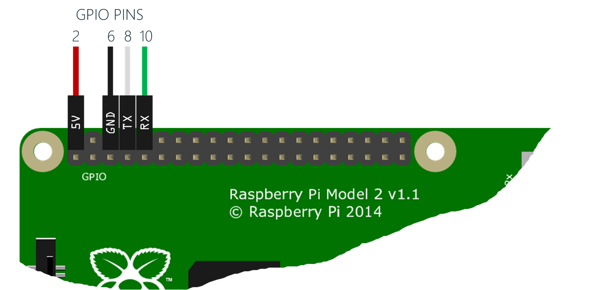	

6. Once you have the wires connected correctly, you can plug the USB end of the cable into your computer's USB port.  **AGAIN, MAKE SURE THE MICRO USB POWER CABLE IS NOT CONNECTED TO THE RASPBERRY PI**

	

7.  When you connect the cable to your Windows Computer for the first time, you should see the USB driver install automatically.  If not, you may need to download the driver for your computer.  

	- Windows Driver - http://www.prolific.com.tw/US/ShowProduct.aspx?p_id=225&pcid=41
	- Mac OSx Driver - http://www.prolific.com.tw/US/ShowProduct.aspx?p_id=229&pcid=41

8. On Windows, you'll need to determine the COM port that was assigned to the serial connection.  From your Control Panel, open the "**Device Manager**" and under the "**Ports (COM & LPT)**" header, locate the COM port that was assigned to the "**Prolific USB-to-Serial Comm Port (COMx)**" .  Make note of the COM port listed at the end.  That is what you will use to connect to your Pi. 

	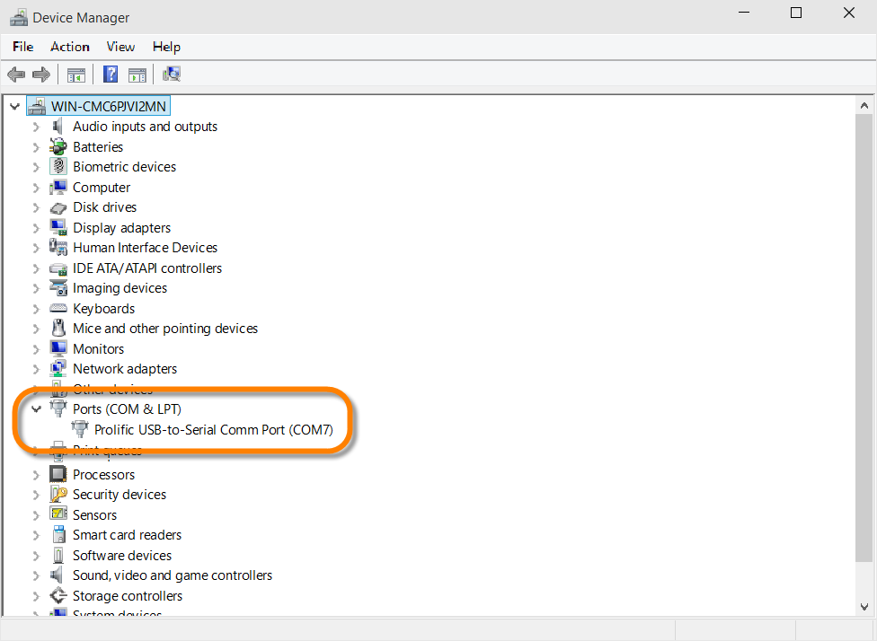

9. Then using the terminal software of your choice (PuTTY is a popular one for Windows, here is a link to an [installer](http://the.earth.li/~sgtatham/putty/latest/x86/putty-0.64-installer.exe) ) ([Screen](https://developer.apple.com/library/mac/documentation/Darwin/Reference/ManPages/man1/screen.1.html) is a popular tool for Mac OSx and Linux), connect to the COM port you discovered above at a baud rate of 115200:  

	

10. When the connection window opens, press the `ENTER` key on your keyboard.  If the Raspberry Pi is still booting, you will see the boot messages.  Regardless, you will eventually be prompted to login:

	- Login:	**pi**
	- Password:	**raspberry**

	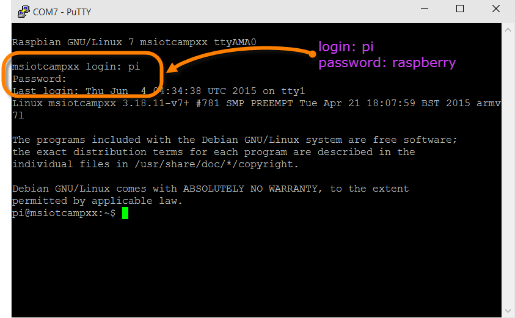


11. Once you are logged in, you can run any of the command line commands on the Raspberry Pi.  You can't start a graphical session though, so **don't try** running **startx**.  

12. One of the first things you may want to do once you are connected is to retrieve the Raspberry Pi's IP Address(es). At the command prompt enter `ifconfig` (short for "interface config") and copy the IP Addresses for your eth0 (Ethernet) and wlan0 (WiFi) interfaces where they exist.  

	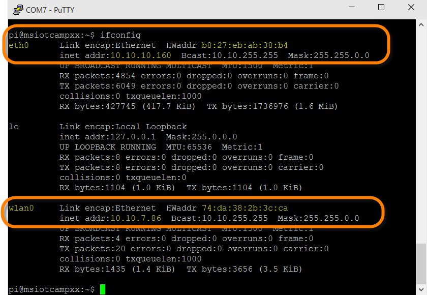

13. Another helpful command is `iwconfig` (wireless config).  It will show you the status of your wireless network, including which wireless network (SSID) you are connected to:

	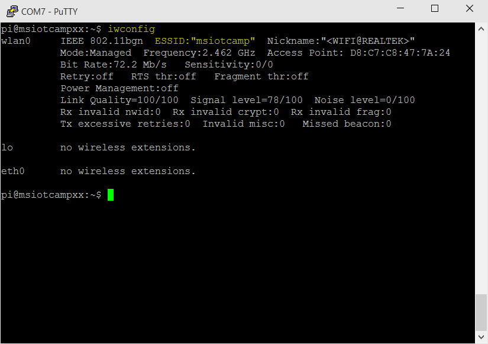

14. Otherwise, now that you are connected, you DO NOT need to ssh into the Raspberry Pi to issue commands.  You are in.  In fact, you can maintain this connection even after a reboot (like after issuing a `sudo reboot` command) 

---

<a name="Appx2"></a>
## Connect to the Raspberry Pi using SSH ##

If you are on the same network as your Raspberry Pi and you know it's IP address, and easy way to connect is using [SSH](http://en.wikipedia.org/wiki/Secure_Shell). To use SSH on Windows, you'll need an SSH client.  Again here, [PuTTY](http://the.earth.li/~sgtatham/putty/latest/x86/putty-0.64-installer.exe) is a popular SSH client for Windows. Mac OSx and Linux distrubutions have an SSH client installed by default.  

For this example, we'll assume you are using PuTTY on Windows.

1. Open PuTTY and configure an SSH connection to your Raspberry Pi using it's IP Address, leave the port at the default value of 22, then click the "**Open**" button

	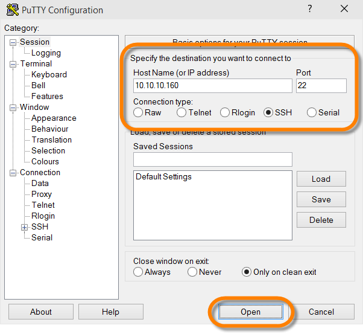

2. If this is the first time you've connected using PuTTY you may receive a Security Alert regarding the certificate that is used.  Click "**Yes**" to confirm the connection:

	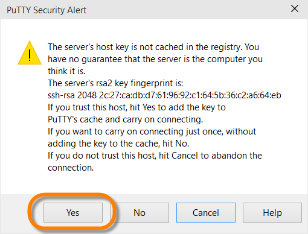

3. Finally, when prompted, login using the credentials:

	- Login:	**pi**
	- Password:	**raspberry**
	
	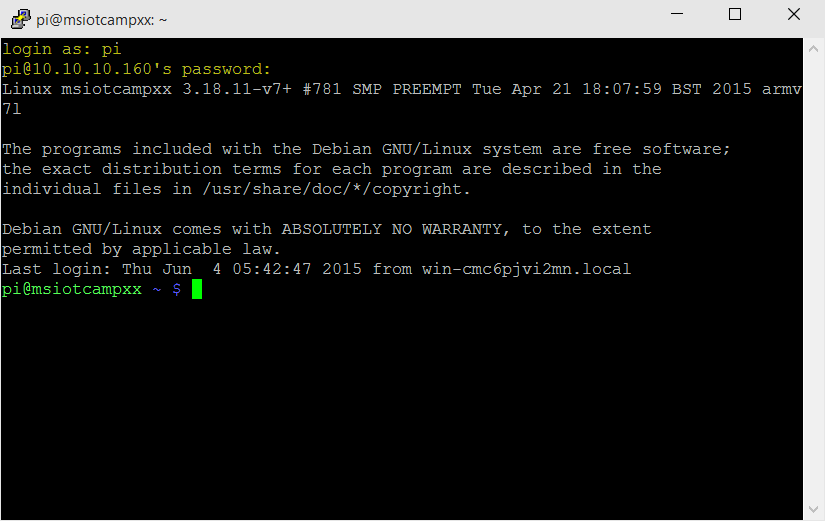

---

<a name="Appx3"></a>
## Connect to the Raspberry Pi using Remote Desktop ##

Another option for connecting to your Raspberry Pi over the network is using the Windows "Remote Desktop" client.  As with SSH you'll need to know your Raspberry Pi's IP Address and be on the same network as the Raspberry Pi.  In addition, prior to connecting with "Remote Desktop" you will have had to first connect to the Pi using another method, and install "**XRDP**":

`sudo apt-get install xrdp`

Then followed up with a reboot

`sudo reboot`

Once you have done that you can connect using a "Remote Desktop" client.  Windows as the Remote Desktop client built in, there is one for Mac OSx [here](https://itunes.apple.com/us/app/microsoft-remote-desktop/id715768417?mt=12).

Here, we'll assume you are using the Windows Remote Desktop client (`mstsc.exe`). 

1. On your Windows computer, From the "**Run**" box on the start menu, or a command prompt, run the command:

	`mstsc /v:<YourRaspberryPiIpAddress>`

2. For example:

	`mstsc /v:10.10.10.160`

	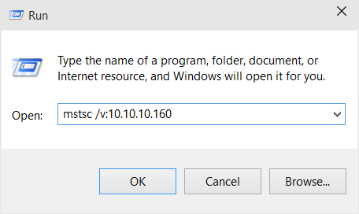

3. If you are prompted to confirm the identity of the remote computer, click "**Yes**"

	

4. Then, in the Remote Desktop Window, login with the default Raspberry Pi Credentials:

	- Login:	**pi**
	- Password:	**raspberry**

	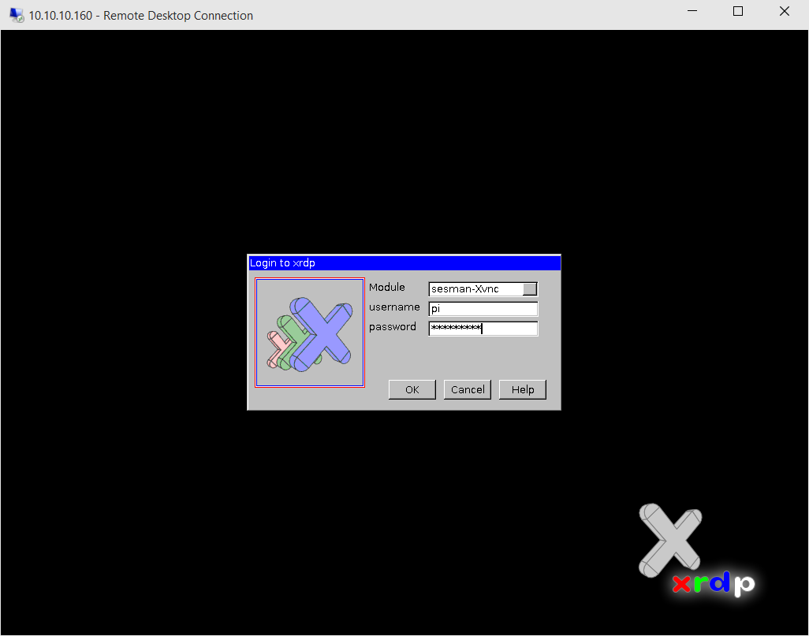

5. Once you are logged in, you can do a number of things.  If you need a command prompt, run "**LXTerminal**":

	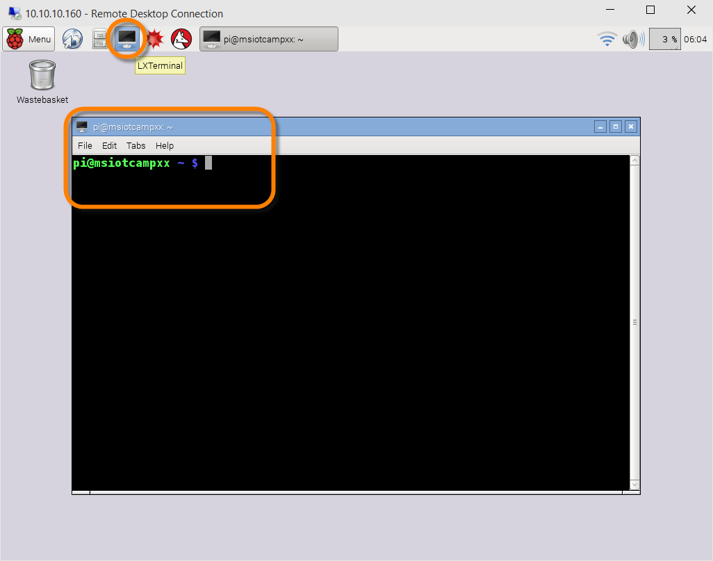

6. You can configure you WiFi Connection:

	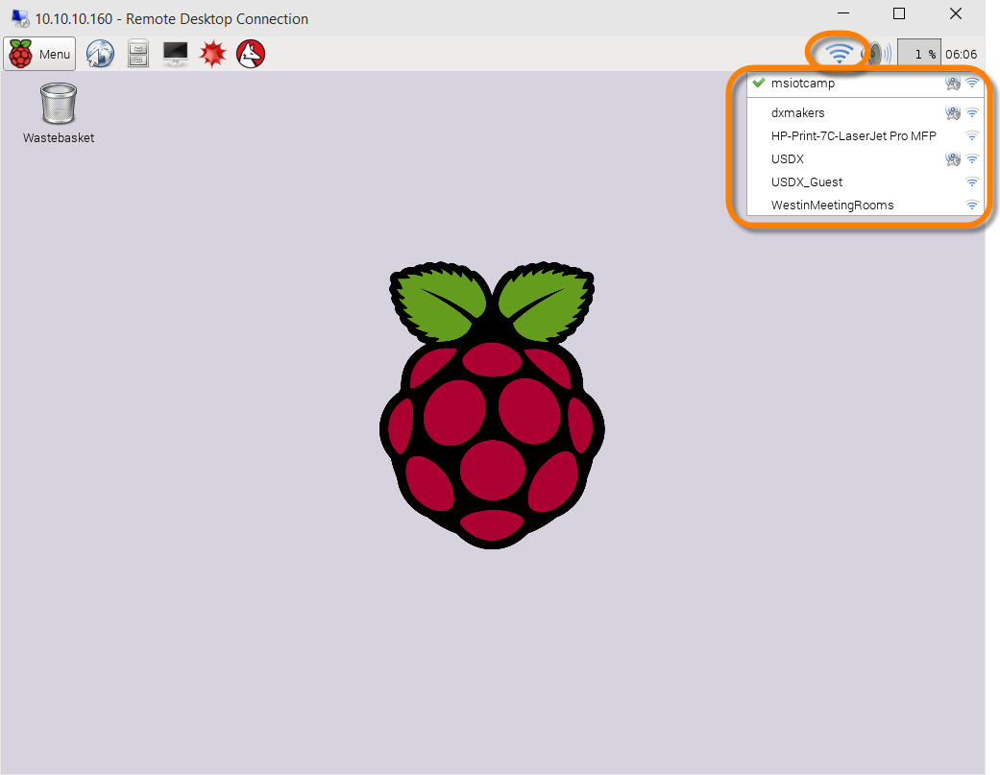

7. You can open a Web Browser

	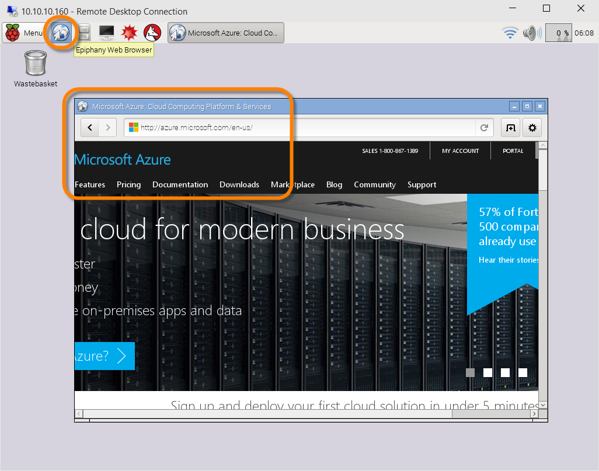

8. Open a Text Editor

	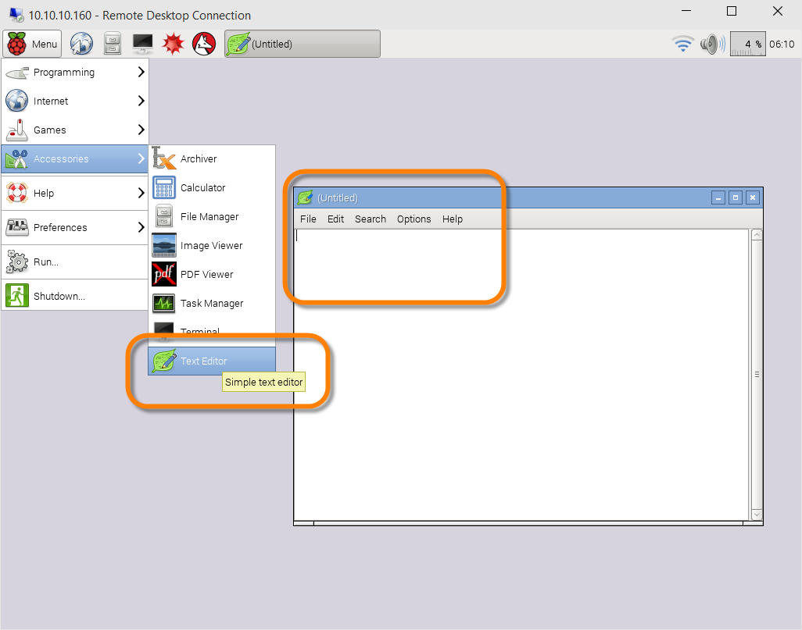

9. To disconnect your session, you can "**Logout**":

	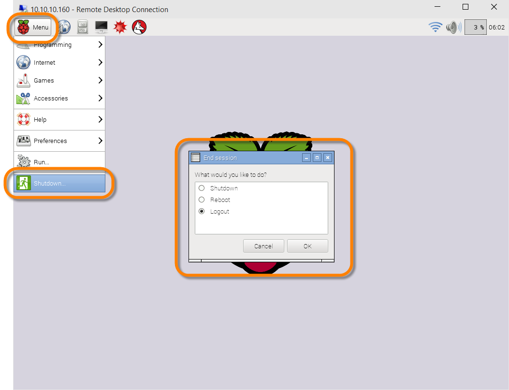

---

<a name="Appx4"></a>
## Connect to the Raspberry Pi using an HDMI Monitor, Keyboard and Mouse ##

With all of the above options above, it's easy to forget that the Raspberry Pi is it's own computer.  We don't NEED to use a remote computer to connect to it.  Sometimes the easiest solution is the most direct.  

If you have access to an HDMI Monitor, and HDMI Cable, and a USB Keyboard and Mouse, you can connect directly to the Raspberry Pi:


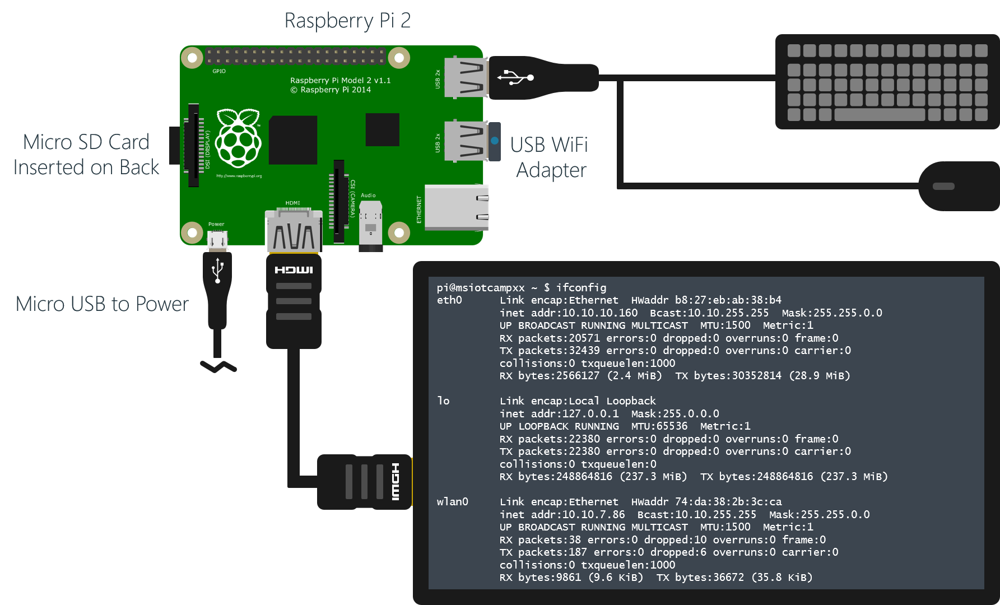

I'ts pretty simple

1. Connect the HDMI Monitor to the Raspberry PI's HDMI Port using a standard HDMI cable.
2. Plug in a USB Keyboard and Mouse (and yes, wireless keyboards and mice with a USB dongle work too)!
3. Connect the "**Micro USB Power**" cable to turn on the PI.  
4. When prompted, login with the default credentials

	- Login:	**pi**
	- Password:	**raspberry**

5. At this point you have the most direct connection possible on the PI.  You can run command line tools as well as the LX Windows graphical environment by running:

	`startx` 

 