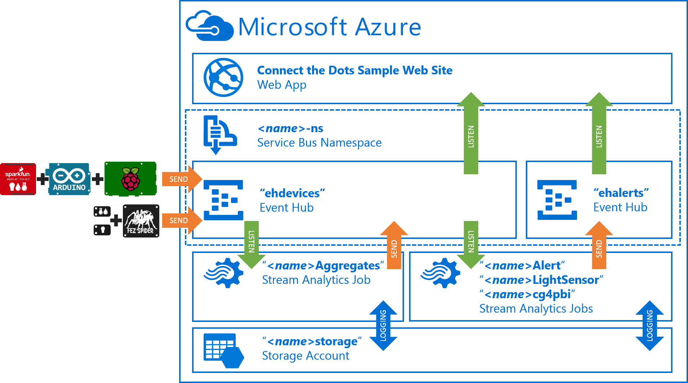
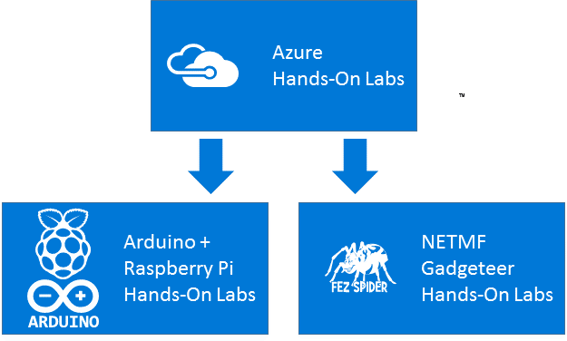

# "Connect the Dots" Hands-On Labs (HOLs) #
---

## Overview ##

These Hands-On Labs (HOLs) are intended to provide a set of step-by-step walk-throughs to help the reader successfully configure their Microsoft Azure environment and one or more devices based on the [ConnectTheDots.io](http://connectthedots.io) architecture.

The labs are broken down into a common set of azure labs that all readers should complete, then a separate set of device specific configuration labs that should be followed based on the type of device you have.  

## General Prerequisites ##

In general, to complete these hands on labs you will need

- An active Azure Subscription.  If needed you can create a [free trial here](http://azure.microsoft.com/en-us/pricing/free-trial "Azure Free Trial"). 

- One or more devices or device pairs that you would like to use
	- Arduino and Raspberry Pi
	- Gadgeteer

- A sensor for the devices to read and publish data for
- The development tools required for each of the device types

The individual labs will provide more explicit prerequisites.   

 
## Azure Hands-On Labs ##

The Azure hands-on labs should be implemented regardless of the types of devices that you wish to use.  These walk you through the configuration of the Azure back end for any of the connected device types to publish data to.   

1. **[Azure Prep](Azure/AzurePrep)** - In this HOL you will create the Azure Event Hubs and Azure Stream Analytics jobs that provide the data ingestion and inspection layer in Connect The Dots.
2. **[Connect the Dots Web Site](Azure/WebSite)** - In this HOL you will configure and deploy the sample "Connect the Dots" website

## "Arduino and Raspberry Pi" Hands-On Labs ##
    
2. **[Raspberry Pi Gateway Setup](/HOLs/Devices/Gateways/GatewayService)** **** - This hands-on lab assumes that you have been provided with a pre-configured image for the Raspberry-Pi on an SD Card.  This walks you through the configuration of the SD Card for your specific setup.   
3. **[Arduino & SparkFun Weather Shield Configuration](/HOLs/Devices/GatewayConnectedDevices/Arduino UNO/Weather/WeatherSheildJson)** - This hands-on lab guides you through configuring an [Arduino UNO](http://www.arduino.cc/en/Main/ArduinoBoardUno "Arduino Uno"``) with a [SparkFun Weather Shield](https://www.sparkfun.com/products/12081) using code from [ConnectTheDots.io](http://connectthedots.io "Connect the Dots") solution.  You'll then connect your Arduino to the previously configured Raspberry Pi and verify that it is publishing data! 

## "NETMF Gadgeteer" Hands-On Labs ##

1. **[NETMF Gadgeteer Configuration](/HOLs/Devices/DirectlyConnectedDevices/NETMF/ConnectTheDotsGadgeteer)** - This hands-on lab walks you through configuring a [FEZ Spider Main Board](https://www.ghielectronics.com/catalog/product/269 "Fez Spider") with [TempHumid S170](https://www.ghielectronics.com/catalog/product/528), [LightSense](https://www.ghielectronics.com/catalog/product/336), [USB](https://www.ghielectronics.com/catalog/product/280), and [Ethernet J11D](https://www.ghielectronics.com/catalog/product/284) or [WiFi RS21](https://www.ghielectronics.com/catalog/product/282) modules. You'll then publish the data from the various sensors up to the Azure Event Hub you created previously. 

